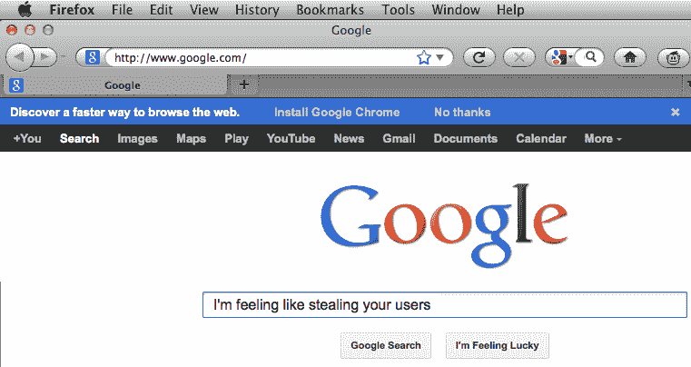
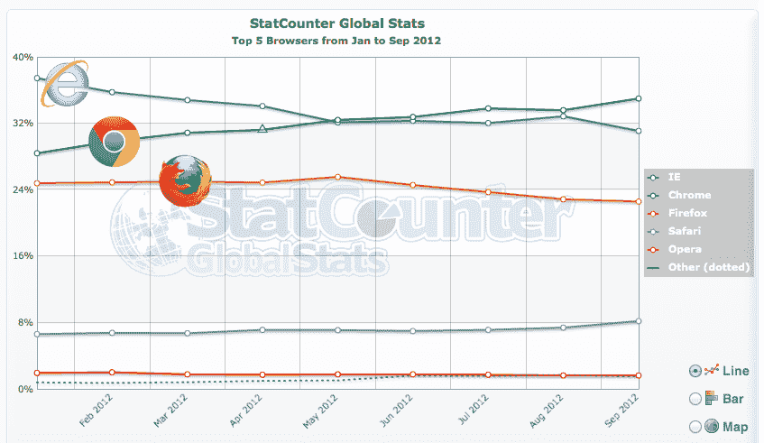

# 安装或被惹恼:谷歌主页唠叨火狐浏览器，互联网探索者转向 Chrome 

> 原文：<https://web.archive.org/web/https://techcrunch.com/2012/09/04/firefox-install-google-chrome-home-page/>

# 安装或被惹恼:谷歌主页唠叨火狐浏览器，互联网浏览器切换到铬

谷歌现在正在推行一项激进的 Chrome 营销活动，该活动曾被用来从其他浏览器那里窃取用户。对一些人来说，每次他们以 Google.com 为主页启动 [Firefox](https://web.archive.org/web/20230331045228/http://www.mozilla.org/en-US/firefox/new/) 或 [Internet Explorer](https://web.archive.org/web/20230331045228/http://windows.microsoft.com/en-us/internet-explorer/products/ie/home) 时，都会看到一个要求他们安装 Chrome 的工具栏。“发现一种更快的浏览网页的方式”它恳求道。

当然，它可能对那些不太了解 Chrome 的人有用。但那些持观望态度的人可能会对这种高压策略感到不满。当谷歌试图把人们从卑鄙的微软旧版本浏览器中拉出来的时候，这是可以容忍的。

似乎不止我一个人觉得这些广告令人讨厌。过去类似的影响火狐用户的活动产生了删除公告的扩展，以及有时阻止其出现的不同谷歌网址。

看，谷歌确实提供了退出广告的服务，但这只是暂时的。你可以点击“不，谢谢”或者安装栏上的“x”来关闭这个通知，但是清除你的浏览器历史将会恢复下拉菜单。等待足够长的时间也可能把它带回来。

Chrome 最近成为世界上使用最多的浏览器，几个月前超过了 Internet Explorer，去年超过了 Firefox。这是一款很棒的产品，也是我的主要浏览器。但拥有 Google.com 这样一个大规模的交叉推广平台肯定不会损害它崛起为霸主的地位。

与此同时，我同时使用 Firefox 来同时登录多个电子邮件和社交账户。所以，我在运行 Chrome 的时候收到这些广告，这确实令人沮丧。

谷歌不能让 Chrome 凭自己的实力繁荣，这有点可悲。我不会把这种对着竞争对手店外的扩音器大喊的数字等效物称为邪恶，但它确实让谷歌看起来很绝望。