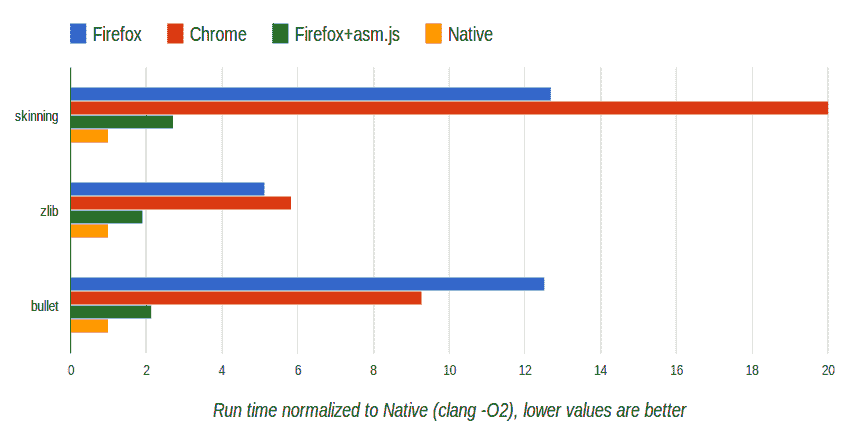

# Firefox Nightly 现在包括 OdinMonkey，使 JavaScript 更接近于以原生速度运行 

> 原文：<https://web.archive.org/web/https://techcrunch.com/2013/03/21/firefox-nightly-now-includes-odinmonkey-brings-javascript-performance-closer-to-running-at-native-speeds/>

# Firefox Nightly 现在包括 OdinMonkey，使 JavaScript 更接近于以原生速度运行

今天的浏览器执行 JavaScript 代码的速度比几年前快得多，但即使我们的 web 应用程序现在看起来更像桌面应用程序，JavaScript 的性能仍然远远低于用 C 或 C++等语言编写的原生程序。为了弥合这一差距，Mozilla 不久前启动了 asm.js 项目，今天，这个代码已经在 Firefox Nightly 中登陆。 OdinMonkey ，Firefox 对其 asm.js 优化模块的命名，允许开发人员用 C 或 C++编写代码，使用 [Emscripten](https://web.archive.org/web/20221007125231/https://github.com/kripken/emscripten) 将其编译成 JavaScript，并以两倍于本机性能的速度运行。

除非该项目遇到任何障碍，否则 Mozilla 预计 OdinMonkey 将在 6 月份推出 Firefox 22 的稳定版本。

Asm.js 是 JavaScript 的一个严格子集，“可以作为编译器的一种低级、高效的目标语言。”正如 asm.ja 规范所指出的，这种子语言“有效地描述了内存不安全语言(如 C 或 C++)的安全虚拟机。”因为它只是 JavaScript 的一个子集，这也意味着代码仍然可以在任何其他浏览器中运行——正如 Mozilla 发言人今天早些时候告诉我的那样，它“在其他浏览器中的运行速度会比在 Firefox 中慢”。

*图片鸣谢:Mozilla 研究员 Alon Zakai (@kripken)*

你可以在这里和 Axel Rauschmayer 的早期文章中找到所有关于它如何工作的血淋淋的技术细节。Mozilla 下周在旧金山举行的游戏开发者大会上也将关注这一点。

从用户的角度来看，这意味着你很快就可以在浏览器中看到更好更复杂的游戏(大多数游戏开发者都使用 C 或 C++，所以这是他们的天然选择)以及更快的网络应用，假设开发者开始采用 asm.js。

如果你想看看 OdinMonkey 能带来什么变化，试试 Firefox Nightly 上的 [BananaBench](https://web.archive.org/web/20221007125231/http://kripken.github.com/misc-js-benchmarks/banana/benchmark.html) 基准测试或这个由 Emscripten 编译的[落盒演示](https://web.archive.org/web/20221007125231/http://kripken.github.com/ammo.js/examples/new/ammo.html)。在我自己的测试中，使用夜间模式时，BananaBench 的运行速度快了大约 3 倍。

目前，Mozilla 只在桌面 Windows 和 Linux 上启用了这一功能，但该组织表示，它将很快在桌面 OSX 和 ARM 上的移动版 Firefox 上启用。

如果你想知道 OdinMonkey 这个名字是从哪里来的，Mozilla 的卢克·瓦格纳[说](https://web.archive.org/web/20221007125231/https://blog.mozilla.org/luke/2013/03/21/asm-js-in-firefox-nightly/)这首死亡金属歌曲是灵感的来源(很遗憾，我一个字也听不懂这些绅士们在尖叫，所以我们只能相信他的话):

【YouTube http://www.youtube.com/watch?v=Y9q41P4VrwI？feature=player_detailpage]