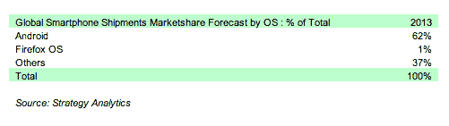

# 2013 年，火狐操作系统将在智能手机中占据 1%的份额，因为安卓系统垄断了低成本市场 

> 原文：<https://web.archive.org/web/https://techcrunch.com/2012/09/27/firefox-os-will-only-take-a-niche-1-of-smartphone-shipments-in-2013-predicts-strategy-analytics/>

谷歌的 Android 智能手机操作系统在低成本智能手机领域面临着许多挑战，从供应商方面的华为、中兴、三星和诺基亚，到来自浏览器软件领域的 Mozilla。但就短期而言，安卓似乎没什么好担心的。Strategy Analytics 今天发布的研究报告指出，其中之一，Mozilla 的移动产品 Firefox OS，在 2013 年仅占全球智能手机出货量的 1%,而 Android 则占 67%,可能需要两年时间才能扭转局面。

公平地说，Firefox 凭借其专注于低成本的智能手机操作系统在运营商和原始设备制造商之间取得了一些进展——那些在 7 月份支持该公司移动操作系统努力的[包括 Telefonica、Sprint、德国电信和中兴通讯。低成本、低于 100 美元的智能手机市场正在增长，德勤(T4)预计仅今年就将售出 5 亿部。](https://web.archive.org/web/20221226084745/http://blog.mozilla.org/blog/2012/07/02/firefox-mobile-os/)

但这种增长，就目前而言，是一个以 Android 为主角的故事。Strategy Analytics 表示，Firefox OS 将继续保持“利基”地位，因为其品牌知名度较低，零售业务有限(特别是在美国)，开发者生态系统仍然太小，该分析师小组表示，这些挑战也将使其在平板电脑市场份额增长方面遇到问题——该公司也希望在这一领域与 iPad 和成本更低的 Android 平板电脑竞争。

第一批基于 Firefox OS 的手机预计将于 2013 年上半年问世。他们将瞄准低成本智能手机市场，而不是与苹果和三星的 Galaxy 系列在高端市场展开竞争。到目前为止，这是一个主要由 Android 主导的领域，在没有任何补贴的情况下，手机价格低至 100 美元或更低。除了其他挑战之外，诺基亚正试图在功能手机市场保持其仍然强大的地位，并在智能手机领域更好地利用这一地位，该公司多年来一直在智能手机领域苦苦挣扎。

与 Android 一样，Firefox OS 是开源的，它没有考虑创建一个原生生态系统，而是将鸡蛋放在 HTML5 移动网络篮子中。但进入低成本市场的时候，谷歌几乎在每个地区都垄断了这个市场。Strategy Analytics 的分析师尼尔·莫斯顿(Neil Mawston)表示:“战胜安卓并非易事。

但他也指出，这并不意味着 Firefox 注定要失败——只是 Mozilla 及其合作伙伴需要保持耐心，看看它是否会起飞。莫斯顿告诉 TechCrunch:“Android 从商业发布到超越 Symbian，从新进入者到公认的全球领导者，只花了两年时间，所以智能手机行业的变化非常快。”根据 SA 的计算，Android 于 2008 年第四季度开始商业化，并在 2010 年第四季度排名第一。

挑战并不仅限于火狐操作系统。“目前，没有一个新兴的智能手机平台，如 Firefox 和 Tizen，拥有与 Android 或苹果相匹配的硬件、软件和服务能力，”他继续说道。

但随着智能手机市场继续增长，它将面临进一步的价格压力，特别是来自充满首次智能手机买家的发展中市场。这是一个增长的机会。“(Firefox 和 Tizen)具有成本竞争力，这让它们有机会在其战略的早期阶段，在对价格敏感的大众市场消费者中获得一些利益。”

尽管如此，他指出，像 Firefox OS 和 Tizen 这样的新平台是“现阶段 Android 的挑战者，而不是 Android 的杀手。”

