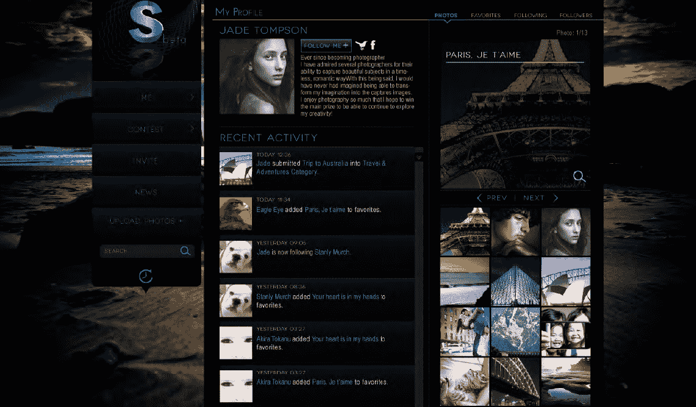

# 首先看看图片分享网络 ImageSocial，它刚刚获得了 TechCrunch 的 1500 万美元投资

> 原文：<https://web.archive.org/web/http://techcrunch.com/2011/10/11/first-look-at-imagesocial-the-photo-sharing-network-that-just-scored-15-million-in-funding/>

本月早些时候，总部位于澳大利亚的 Mooter Media 从旧金山投资公司 La Jolla Cove Investors，Inc .获得了 1500 万美元，以推出一个新的社交摄影平台。该平台名为 ImageSocial，将与技术开发合作伙伴 [Hot Shot Media](https://web.archive.org/web/20230204110558/http://hotshotmedia.com/) 共同打造，与传统的照片分享网络不同，它还将包含游戏元素。

推出时，ImageSocial 用户将能够参与 Mooter 所说的“有史以来最大的在线摄影比赛”，而不仅仅是将用户加为好友和上传照片比赛将包括寻找我们这一代最具决定性的时刻，并将颁发“大奖”。

对 ImageSocial 的投资是近年来澳大利亚科技公司最大的投资之一。与其幅员辽阔相比，澳大利亚更多时候是一个在科技初创公司世界中代表性不足的地理区域。根据与 La Jolla 的协议，Mooter 将获得五份承诺的、连续的和不可放弃的可转换票据，每份 300 万美元，为该公司提供资本注入。最初的提款将是每月 20 万美元，随着股价的上涨，每月可以增加到 100 万美元。(Mooter Media 是一家上市公司)。

显然，该公司计划将这个新的照片分享平台做大。

这笔资金还将用于建立该公司位于旧金山的开发和营销部门，以及快速开发和商业化的图像社交平台。

当 ImageSocial 在 2012 年 Q1 发布时，它将鼓励用户通过台式机、平板电脑或移动设备在网络上分享照片，并鼓励他们为他人的照片投票。

Hot Shot Media 的首席执行官克里斯·杰明(Chris Jermyn)解释说，照片分享比赛被定位为“美国偶像”式的真人秀比赛:

> “大约 10 年前，《美国偶像》抓住了全世界电视观众的心、思想、想象力和狂热的投票，迫使一代人去竞争、去梦想、去参与。作为一个概念，《美国偶像》经受住了时间的考验，它定义了一种模仿者众多但征服者寥寥无几的类型……我们与《美国偶像》的相似之处根深蒂固，利用社交媒体的力量允许大规模、全球范围的互动竞争——但那些曾经只是观众的人现在可以成为直接参与者——自己创造、竞争并赢得胜利。”

我们有点担心“偶像”的提法——难道他们不知道我们都厌倦了那个节目吗？

好吧，我开玩笑(嗯，算是吧)。但是，尽管鉴于数码相机和拍照手机的普遍存在，仍然有足够的空间让更多的照片分享初创公司、应用程序和平台存在，但以游戏为主要吸引力的照片分享网络的想法仍然有点风险，至少在这个规模上是如此。ImageSocial 并不是第一个将照片分享体验“游戏化”的公司，[新推出的 Piictu](https://web.archive.org/web/20230204110558/https://techcrunch.com/2011/09/22/piictu-launches-grabs-seed-funding-to-grow-its-game-ified-photo-sharing-app/) ， [Snapr 的 Capture the Flag](https://web.archive.org/web/20230204110558/http://capturethefl.ag/) ，[我在哪里？](https://web.archive.org/web/20230204110558/http://whereamiapp.com/)、[保留了](https://web.archive.org/web/20230204110558/http://thirdcircle.com/chronicles/2011/09/28/kept-for-the-iphone/)，还有数十家公司正在尝试让照片分享更像游戏。

下面，我们得到了 ImageSocial 即将出现在桌面和 iPad 上的一些截图。

