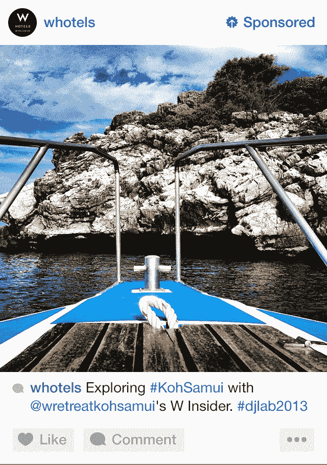
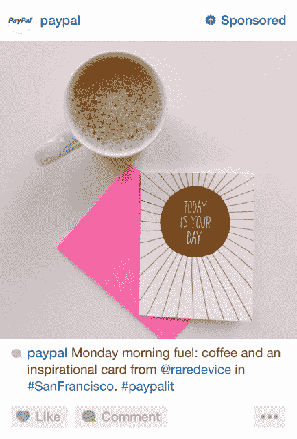
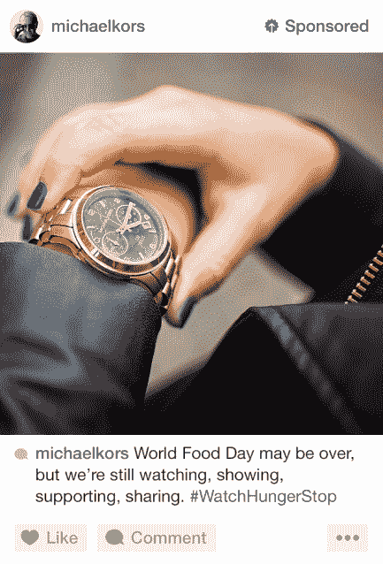
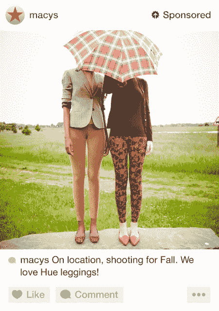
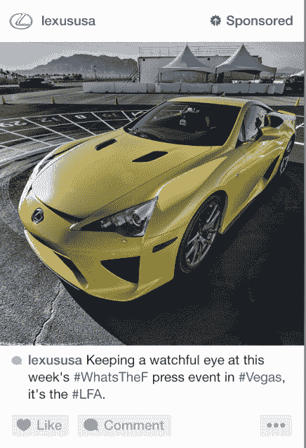
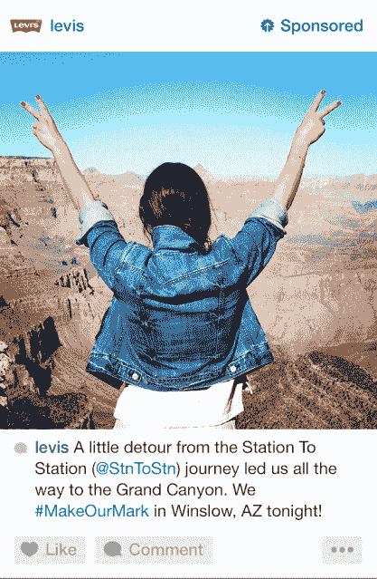
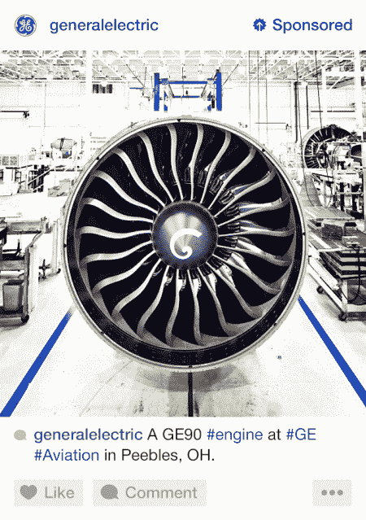
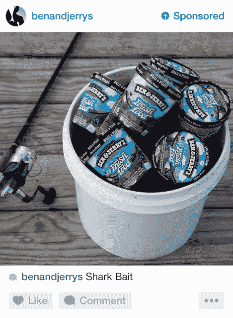
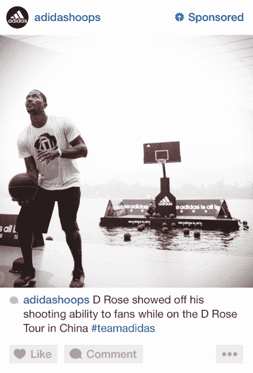

# 这是 Instagram 广告的样子

> 原文：<https://web.archive.org/web/https://techcrunch.com/2013/10/24/first-look-at-instagram-ads/>

Instagram[刚刚发布了 insta gram 广告的第一张图片](https://web.archive.org/web/20230301173233/http://instagram.com/about-ads)。

上个月，[公司宣布](https://web.archive.org/web/20230301173233/https://techcrunch.com/2013/10/03/instagram-starts-showing-in-feed-video-and-image-ads-to-us-users/)赞助的照片和视频将开始出现在人们不关注的品牌的信息中，承诺一些美丽和迷人的东西。

这张“偷窥”是一个家伙坐在桌子前的照片。你觉得怎么样？

这些广告将被标上“赞助商”字样，并有一个隐藏它们的按钮。如果你点击三点“更多”按钮(…)，广告将被隐藏，你可以提供反馈，说明你不喜欢它的原因，或者选择退出该广告。

样本广告来自 Instagram 本身，这将是美国许多 Instagram 用户看到的第一个广告。

正如[所承诺的](https://web.archive.org/web/20230301173233/https://techcrunch.com/2013/09/08/topping-150m-users-instagram-promises-ads-within-the-next-year/)，Instagram 表示，只有少数品牌将被允许在平台上做广告(在开始阶段)，所有这些品牌都将为平台上的现有用户所熟悉。

以下是来自[博客](https://web.archive.org/web/20230301173233/http://blog.instagram.com/post/64973363225/adsoninstagram)的官方消息:

> 我们对每一款产品的关注都是为了让 Instagram 成为人们交流和获得灵感的地方。将 Instagram 打造为一项业务将有助于我们更好地服务于全球(以及不断增长的)Instagram 社区，同时保持您所了解和喜爱的简单性。

Instagram 还提醒用户，我们拥有并控制我们的 Instagram 照片，当 Instagram 改变其 tos 以允许用户生成内容制作的广告时，这个问题引起了激烈的辩论。起义之后，这个决定被推翻了。

这一次，用户对引入广告的呼声降低了，因为它不涉及我们的面部(谷歌风格)，但一旦广告真正开始出现在提要中，这种情况可能会改变。

你可以在下面看到一系列 Instagram 广告的例子，包括李维斯、W 酒店、迈克高仕、梅西百货和雷克萨斯等顶级品牌，以及一些不太时尚的公司，如 PayPal 和 Ben & Jerry's。

