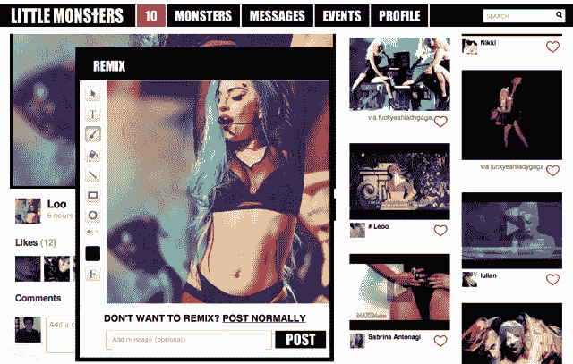
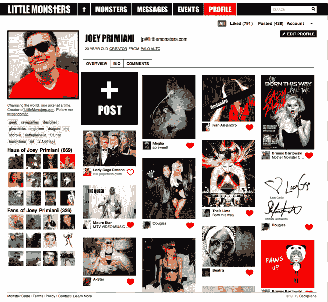

# 第一眼:Backplane，Lady Gaga 支持的社区平台，全明星投资者(邀请)

> 原文：<https://web.archive.org/web/https://techcrunch.com/2012/01/20/first-look-backplane-the-lady-gaga-backed-community-platform-with-all-star-investors-invites/>

去年初夏[我们写了](https://web.archive.org/web/20230330230105/https://techcrunch.com/2011/06/05/lady-gaga-and-eric-schmidt-invest-in-a-startup/)关于[背板](https://web.archive.org/web/20230330230105/http://www.thebackplane.com/)，一个神秘的初创公司，背后有令人印象深刻的支持者和一些主要的明星力量:它的联合创始人之一 Troy Carter 是 Lady Gaga 的经理。Lady Gaga 本人在该公司拥有大量股份，并亲自参与其发展。

到目前为止，关于该公司产品的细节还很少。但是我们有一些独家的细节——以及 TechCrunch 读者的测试代码，他们将是第一批试用该产品的人。

首先，该公司投资者的最新名单:Backplane 目前正在进行一轮融资，包括许多技术领域的顶级风投，包括 SV Angel、谷歌风投、创始人基金天使投资、埃里克·施密特的明日风险投资、Lerer Ventures 和 Menlo Ventures。

该公司表示，它正在大举招聘，重点是吸引硅谷的顶尖工程师。这对硅谷的初创公司来说并不罕见，但 Backplane 有着重要的技术信誉，可以激起大量的兴趣:联合创始人乔伊·普里米亚尼(Joey Primiani)是前谷歌员工，也是 Cortex 的创始人。联合创始人亚历克斯·摩尔(Alex Moore)是 Palantir Technologies 的前运营总监(也是第一名员工)，Palantir Technologies 是硅谷科技含量最高的公司之一。Palantir 的联合创始人 Joe Lonsdale 是 Backplane 的董事会主席。其他入选者还有谷歌和脸书的前雇员。

但是*到底是什么*背板呢？

昨晚，我提前访问了这个网站——或者更确切地说，是第一个由背板平台驱动的门户网站[LittleMonsters.com](https://web.archive.org/web/20230330230105/http://www.littlemonsters.com/)。从我有限的使用来看，该网站似乎结合了 Pinterest、Tumblr、Canvas 和 Ning 的一些关键功能，以产生一个高度可视化和潜在高度参与的社区平台。

Little Monsters 将成为 Lady Gaga 和她的粉丝们的一个新的在线社区，但 Backplane 有更大的野心:它旨在为广泛的兴趣小组提供动力社区网站，涵盖从名人到小众主题的一切。

最初登录 LittleMonsters 后，我看到了一个格子，排列方式让人想起 Pinterest。Lady Gaga 的照片构成了这些瓷砖的大部分，尽管还有少量其他内容——包括我在那里的一张照片(每当有人加入该网站时，该网站就会创建一个新帖子)。点击这些照片中的一张，就会以更大的尺寸显示出来，在某些情况下，还会链接到附带的文章或视频。

也许比内容本身更重要的，是社区方面。用户可以点击一个越来越普遍的心形图标来“喜欢”一个帖子，这使得它在网格中显得更加突出，他们还可以在每个帖子下面留下评论。该平台还借用了 [Canvas](https://web.archive.org/web/20230330230105/http://canv.as/) 的一个功能:你可以拍摄任何照片，并使用内置的、易于使用的图像编辑器对其进行修改，然后与社区的其他人分享你的新创作。

还有许多更高级的功能——该平台旨在成为你各种兴趣小组的日历，并支持与谷歌日历和 Gmail 的集成。随着越来越多的社区出现在背板平台上，它们将变得更加交织在一起，用户可以在各个门户之间来回切换。

当我尝试的时候，这个网站只对相对较少的用户开放，很难判断这一切是如何协同工作的。在该网站向公众发布之前，仍有大量的变化要做——back plane 首席执行官 Matt Michelsen 表示，该网站仍处于早期测试阶段，在几个月后发布之前，很可能会看到一些重大的调整(换句话说，这更多的是对未来的尝试，而不是对最终产品的早期访问)。无论如何，我目前所看到的显然是有希望的。

如果你想亲自体验一下这个网站，前 50 名向 info@thebackplane.com 发送电子邮件的 TechCrunch 读者将会收到测试代码。

