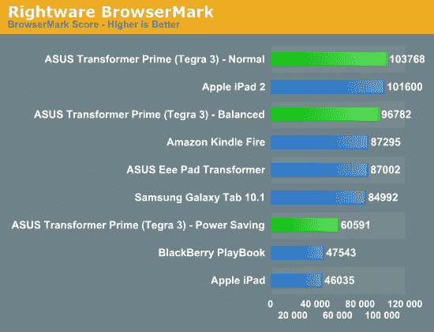

# 首先，Nvidia Tegra 3 基准测试的四核芯片得分仅略快于苹果的 A5 

> 原文：<https://web.archive.org/web/https://techcrunch.com/2011/12/01/first-nvidia-tegra-3-benchmarks-score-the-quad-core-chip-just-slightly-faster-than-apples-a5/>

# 首先，Nvidia Tegra 3 基准测试的四核芯片得分仅略快于苹果的 A5

暂时忘记[规格与](https://web.archive.org/web/20221006232910/https://beta.techcrunch.com/2011/11/14/rip-spec/)无关。由于华硕 Transformer Prime，Nvidia Tegra 3 的第一个竞争基准刚刚开始。英伟达的四核移动平台将可能成为驱动冰淇淋三明治平板电脑的事实上的芯片组；明年它将无处不在。英伟达长期以来一直吹捧 Tegra 3 的处理能力，称该平台绝对会击败所有竞争对手，包括老化的双核苹果 A5。然而，事实似乎并非如此。早期的基准测试表明 A5 保持得很好。

[Hot Hardware](https://web.archive.org/web/20221006232910/http://hothardware.com/Reviews/Asus-Eee-Pad-Transformer-Prime-Preview/?page=6) 和 [AnandTech](https://web.archive.org/web/20221006232910/http://www.anandtech.com/show/5163/asus-eee-pad-transformer-prime-nvidia-tegra-3-review/2) 都拿到了 Transformer Prime 平板电脑，并对其进行了详尽的测试，包括多项基准测试。在大多数测试中，Tegra 3 供电的变压器优于 iPad 2，但只是略有差异。大多数基准测试都是测试真实世界的活动，比如网页浏览和 JavaScript。然而，图形渲染也进行了测试，只有在使用 GLBenchmark 2.1 时，Transformer Prime 才会完全破坏 iPad 2。iPad 2 中的 A5 实际上在 BaseMark ES 2.0 的每秒帧数 OpenGL 测试中超过了 Tegra 3。

测试确实表明，Tegra 3 比 Tegra 2 有了很大的改进。

当然，这些早期的基准可能会在很多方面被扭曲。基准 mark 软件可能尚未针对四核 Tegra 3 进行优化。GLBenchmark 的 Android 应用程序上次更新是在 9 月。此外，这两个平台上还没有测试 CPU 性能的基准。当直接比较时，Tegra 3 的四核设置可能会击败 A5。

Tegra 3 的渲染和 OpenGL 性能只是该芯片吸引力的一部分。四核芯片实际上具有第五个所谓的伴侣核心，用于低级和后台处理，最终将提高电池寿命。Tegra 3 还为开发者提供了一个更加强大的系统，这将有望改善整个 Android 生态系统。

规格(和基准)[再一次变得没有意义](https://web.archive.org/web/20221006232910/https://beta.techcrunch.com/2011/11/14/rip-spec/)。普通消费者不关心配套内核或 Javascript 性能。简单地说一个平板电脑是由一个强大的处理器驱动的，对电池来说很容易满足大多数人。但是，如果同样的消费者被告知苹果平板电脑的芯片功耗略低，但可用应用数量是苹果平板电脑的十倍，那么 iPad 又一次胜出。内容还是王道。