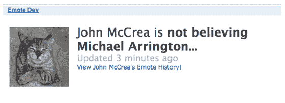

# 首个在 45 分钟内被黑的 OpenSocial 应用程序

> 原文：<https://web.archive.org/web/https://techcrunch.com/2007/11/02/first-opensocial-application-hacked-within-45-minutes/>

没多久就有人破解了第一个 [OpenSocial](https://web.archive.org/web/20230328091334/https://techcrunch.com/2007/10/30/details-revealed-google-opensocial-to-be-common-apis-for-building-social-apps/) 应用程序。事实上，只花了 45 分钟。

一名化名为“黑客”的开发人员称自己“只是一个业余爱好者”，并声称已经破坏了 Plaxo 上名为 emote 的 RockYou OpenSocial 应用程序(有关该应用程序的详细信息，请参阅 Plaxo 博客[)。具体来说，他声称在 Plaxo 副总裁营销 John McCrea 的个人资料发布后 45 分钟内添加了一些表情符号。](https://web.archive.org/web/20230328091334/http://blog.plaxo.com/archives/2007/11/first_peek_at_o.html)

在一封电子邮件中，McCrea 说他自己添加了所有的表情符号，他的账户似乎没有被黑。但当我要求黑客侵入我的 Plaxo 账户时，他在几分钟内添加了四条快速表情信息，比如“迈克尔·阿林顿穿上了我的珠宝”和“迈克尔·阿林顿是 w00t”(见左图，这些都不是我添加的)。这位脾气暴躁的家伙接着又在麦克瑞的账户上增加了一项，这一点他很难否认:

黑客还指出了 RockYou 代码的一些具体问题，包括一些相当幽默的评论:

> 里面有一些有趣的代码。一方面，该应用程序对我们大多数人来说似乎还没有上线(Plaxo 的 John McCrea 以某种方式使用了它)——它当前加载了一个永不改变的“请等待”iframe。但是，请查看以下代码注释:
> 
> // TODO:没有错误检查——我们很大胆……
> //TODO:弄清楚为什么这是必要的？？？
> 
> 此外，代码经常在 Plaxo 和“default”之间分支，后者看起来像是 Orkut。事实上，有些硬编码的名字我敢打赌会出现在一些 OpenSocial 的截图中:
> 
> if(getcontainer type()= " or Kut ")
> {
> friend id[iNumFriends]= " 11285577331363942034 "；
> friend name[iNumFriends]=“Raymond Chan”；
> iNumFriends = iNumFriends+1；
> 
> friendid[iNumFriends]= " 15479081059638046412 "；
> friend name[in mfriends]=“沈嘉”；
> iNumFriends = iNumFriends+1；
> }

这个黑客家伙说他也成功黑了脸书的应用程序，包括 Superpoke 应用程序，但是更困难的是:

> 脸书应用程序没有这么简单。我发现脸书应用的主要问题是能够访问人们的应用相关历史；例如，直到最近，我还可以访问任何用户的 SuperPoke 动作提要。(我也可以超级用户；不知道他们有没有修好那个。最后，我可以访问所有的 SuperPoke 操作——他们没有修复那个，但它只是为了好玩。)据我所知，在其他应用中，这仍然是一个问题(例如，查看任何人的涂鸦帖子)。
> 
> 但是脸书建立他们平台的方式，实际上模仿一个用户并像这样改变个人资料信息是非常困难的。我相信这种问题可以通过 RockYou 的一些验证码轻松解决，但它不是平台固有的——不像脸书。如果脸书没有按照他们的方式设置事情，我可以在 FB 上做更多这样的事情。
> 
> 哦，脸书应用程序也容易被注入——我可以把任何我想要的 FBML 插入到一个流行应用程序的画布页上。但同样，我真的什么也做不了，因为与应用程序交互需要我拥有与该应用程序相关的代码，而这通常是不可用的。不确定 Google 的 iframe 实现是否也是如此。

当然，改变表情符号的能力并不是特别恶意的攻击；但是这么容易就做到了，这表明谷歌在稳定其新平台方面还有一些工作要做。如果他们不这样做，更具破坏性的事情可能正在发生。

Plaxo 的首席平台架构师 Joseph Smarr 表示，他已经将该应用程序暂时撤下:

> 嗨，刚刚抓住这个线程。迈克尔-谢谢你的信息。看起来确实有些地方不太对劲。虽然我怀疑这是良性的，例如，一些 rockyou 代码没有区分小工具的“所有者”和“查看者”(这种事情并不总是容易保持正确)，但我想谨慎起见，所以我现在将取消小工具的白名单。
> 
> 目前，我们正在维护一份严格的白名单，这样我们就不会有任何随机的潜在黑客来捣乱，而且这个平台本身仍然是一项正在进行中的工作。希望在生产中看到一些真正工作的 OpenSocial 代码的好处是值得忍受一些需要解决的问题。