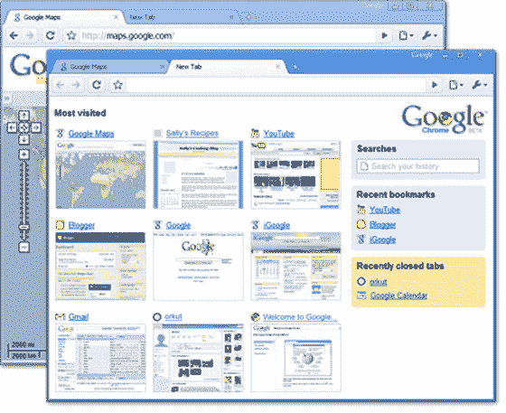

# 谷歌 Chrome  的首批图片

> 原文：<https://web.archive.org/web/https://techcrunch.com/2008/09/01/first-public-screen-captures-of-google-chrome/>

# 谷歌浏览器的第一张图片

**更新:**谷歌给予，谷歌取走 Chrome 网站现已关闭。

谷歌似乎已经为谷歌 Chrome 浏览器[试运行了](https://web.archive.org/web/20230317153000/https://techcrunch.com/2008/09/01/no-joke-google-introduces-its-own-browser-with-a-cartoon/)[这个网站](https://web.archive.org/web/20230317153000/http://gears.google.com/chrome/?hl=en)，谷歌 Chrome 浏览器，该浏览器定于明天在 Windows 上发布。

该网站提供了上面的截图，加上一组实际上无法播放的演示视频，因为它们要么已经被删除，要么被设置为隐私。我们已经上传了这些视频的启动画面，这样你至少可以对 Chrome 的功能有一个模糊的认识。

