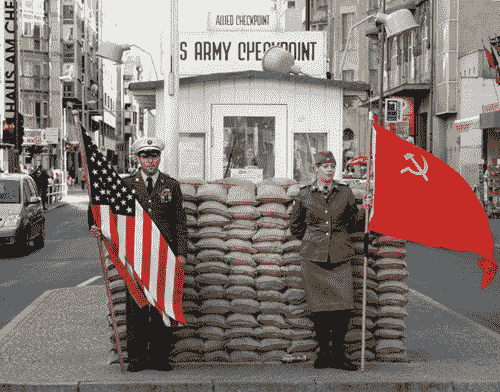

# 第一击，使命召唤:黑色行动的第一个 DLC 地图包:2 月 1 日，Xbox 360 定时独家

> 原文：<https://web.archive.org/web/https://techcrunch.com/2010/12/20/first-strike-call-of-duty-black-ops-first-dlc-map-pack-february-1-xbox-360-timed-exclusive/>

# 第一击，使命召唤:黑色行动的第一个 DLC 地图包:2 月 1 日，Xbox 360 定时独家

限时专卖权再次来袭。尼尔森少校在他的最新播客中说[使命召唤:黑色行动](https://web.archive.org/web/20230316005352/http://www.crunchgear.com/tag/call-of-duty-black-ops/)的第一个 DLC 地图包，名为第一击(/me rolls eyes)，将于 2 月 1 日在 Xbox 360 上独家*发售*。如果你愚蠢到在其他平台上购买游戏——这是微软试图通过这些限时独家发布的信息，对吗，360 是玩游戏的*地方，所以你光顾其他平台是愚蠢的？—你得再等一个月。呸。*

DLC 的价格通常为 1200 微软积分(约 15 美元)，将配有四张地图，其中一张地图位于柏林查理检查站内和周围。

如果你以前从未去过那里，查理检查站已经成为一个旅游陷阱，正如你在上面的照片中看到的。