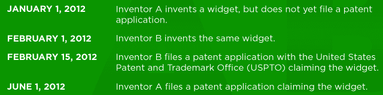
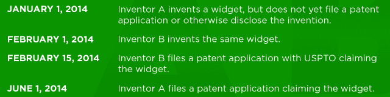

# 最先申请的专利法即将出台，但这意味着什么呢？

> 原文：<https://web.archive.org/web/https://techcrunch.com/2013/02/16/first-to-file-a-primer/>

**编者按:** *列昂尼德(“莱尼”)克拉韦茨是宾夕法尼亚州费城 LLP 的[潘尼奇、施瓦兹、贝利萨里奥和纳德尔](https://web.archive.org/web/20230329114639/http://www.panitchlaw.com/Lawyers-Advisors/Leonid-Kravets.aspx)律师事务所的专利律师。Lenny 专注于计算机相关技术领域的专利起诉和知识产权交易。他专门为年轻的技术公司制定知识产权战略，并在 StartupsIP 上发表了关于这个主题的博客。在 Twitter 上关注 Lenny[@ lkravets](https://web.archive.org/web/20230329114639/https://twitter.com/#!/lkravets)。*

[美国发明法案](https://web.archive.org/web/20230329114639/http://www.govtrack.us/congress/bills/112/hr1249/text) (AIA)的通过带来的主要变化之一是美国专利法从“先发明”制度到 3 月 16 日“先申请”制度的转变。距离过渡期只有四周了，理解专利制度的这一变化对发明者和公司意味着什么是很重要的。

##### 最先发明的

在讨论先发制人之前，重要的是要了解先发制人系统是如何工作的，我们已经在这个系统下运行了 200 年。在最先发明制度下，当两个或两个以上的发明人就同一项发明提出专利申请时，专利局应确定并授予最先[构思并努力将发明付诸实践](https://web.archive.org/web/20230329114639/http://www.uspto.gov/web/offices/pac/mpep/s2138.html)的发明人专利，即使(受某些限制)第一发明人不是最先提出专利申请的人。一个例子有助于说明这个系统:

在这种情况下，即使发明人 A 在发明人 B 之后提交了她的专利申请，发明人 A 也将有权获得其小部件的专利。发明人 A 可能需要通过展示关于其小部件的早期发明日期的文档来“宣誓支持”发明人 B 的专利申请，并且她努力工作以实际或建设性地“将发明付诸实践”(可以通过准备和提交专利申请来展示将发明建设性地付诸实践)。在最先发明的制度下，发明者 B 不会获得发明专利。

##### 先入文件

2013 年 3 月 16 日实施的先申请制度试图通过淡化实际发明日期来进一步协调美国专利法和世界其他大多数国家的专利法。

许多知情人士认为，先申请的改变对专利钓鱼者来说是一个福音，因为他们将能够对资金不足的初创公司已经发布但尚未申请的发明提出专利申请。然而,“第一文件”这个术语有点用词不当。在美国，无论是先发明还是先申请，发明者都可以公开披露他们的发明，如在博客上，并在公开披露后一年内提交专利申请。AIA 下实施的系统并不像大多数外国国家那样是真正的先备案系统，因为公开披露的宽限期仍将存在。因此，新制度可以真正被认为是一个“首先披露”的制度。

### 这一新制度确实可以被认为是一个“首先披露”的制度。

发明者可以尝试营销和销售他们的发明，并在首次公开披露后一年内在美国申请专利。然而，他们将不能在大多数外国为先前公开的发明申请专利，因为采用先申请标准的外国通常没有这种公开披露的宽限期。在这些外国，在提交专利申请之前的公开披露是获得所披露发明的专利的绝对障碍。

考虑到披露宽限期，在 3 月 16 日实施的先申请/先披露制度下，要考虑的关键问题不是像先发明制度那样一项发明何时被首次构思，而是该发明何时被另一个发明人首次公开披露或首次向 USPTO 申请。因此，虽然一个发明人可以公开披露他的发明，并且仍然在披露后的一年内向 USPTO 提交专利申请，但是该披露将阻止任何其他发明人获得同一发明的专利，即使其他发明人在披露前发明了同一发明。

类似地，如果之前没有披露，由后来的发明人向 USPTO 提交的申请将使后来的发明人有权获得专利，即使第二个发明人在第二个发明人的申请日之前提出了该发明。一个例子可以更好地说明这种情况:

在这种情况下，发明者 B 将获得专利，尽管发明者 A 首先想到了小部件的发明。因此，发明人 A 将被禁止实施由发明人 B 申请专利的发明，即使他在发明人 B 之前提出了该发明。

现在考虑第二个稍微修改过的场景:

在这个修改的场景中，即使发明人 B 先提交了他的专利申请，发明人 A 也有权获得专利，因为发明人 A 在发明人 B 提交其专利申请之前披露了该发明。因此，由于发明人 A 在其公开披露后一年内提交了专利申请，因此发明人 A 将有权获得该专利。因此，发明人 B 将被禁止实施由发明人 a 申请专利的发明。

在一个人得知另一个发明人披露了一项发明、复制了该想法并试图根据先申请提交专利申请的情况下，复制人不能通过简单地先提交专利申请而获得关于该发明的有效专利，因为他没有“发明”该发明，因此无权获得专利保护(尽管如果 USPTO 将专利授予非发明人，举证责任将由另一方承担，以证明该非发明人不是专利技术的真正发明人)。

同样，非发明人也不能通过基于从发明人处获得的信息公开披露发明来阻止发明人获得专利，因为在这种情况下，发明人仍将保留一年的宽限期来就该发明提出专利申请。

##### 准备先入为主

公司可以通过多种方式为实施“先申报”做准备。虽然最好是尽快提交专利申请，但在实施先申请之前，公司应考虑是否应提交临时申请，以确保先发明申请日期。公司还应该开发快速识别发明的流程，并决定是否申请专利、公开或以其他方式保护这些发明。

在 3 月 16 日之前向 USPTO 提交临时或非临时专利申请是确保该申请在最先发明制度下得到处理的唯一方法。虽然优选提交非临时申请以确保专利申请的权利要求完全由说明书中的描述支持，但是如果预算和时间不允许在 3 月 16 日之前提交非临时申请，则在准备临时申请(其不需要权利要求)时应该非常小心以确保本发明和任何已知的变化被完全详细地公开。

非常小心地详细描述该技术和所有已知的变化是很重要的，因为如果临时申请在 3 月 16 日转换日期之后被转换，则任何未被原始“最先发明”临时申请支持的针对公开的权利要求将在先申请制度下被处理。

在 3 月 16 日实施后，先申请将为发明者和企业带来独特的挑战和机遇。适时披露发明可以阻止资金更雄厚的竞争对手获得专利。然而，延迟专利申请或披露流程可能会因将申请暴露给更多的现有技术而导致专利权丧失。更糟糕的是，延迟披露或提交专利申请可能会允许竞争对手就同一技术提交专利申请，即使他们后来发明了该技术。

因此，公司应该寻求建立流程来快速有效地识别发明，并决定是否提交专利申请或以其他方式公开披露这些发明。如果该技术值得专利保护，在技术开发过程中提出一系列低成本的临时申请可能是为该技术确定一系列早期“首次申请”申请日期的一种具有成本效益的方式。

另一方面，如果决定一项发明不值得立即提出专利申请，公开披露该发明应防止其他人获得相同技术的专利。但是，在提交专利申请之前公开披露一项发明的决定不应轻率做出。提交专利申请前的公开披露可能会导致外国专利权被没收。就软件而言，在大多数外国专利制度中，软件是不能申请专利的，这不是问题。因此，披露基于软件的发明是为他人创造现有技术的理想方式，而不会丧失公司本应享有的任何专利权。