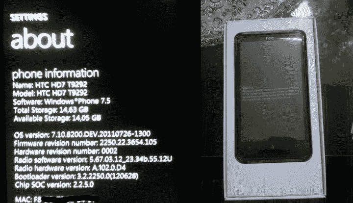

# 首款 Windows Phone Tango 设备(某种程度上)在斯洛伐克上市 

> 原文：<https://web.archive.org/web/http://techcrunch.com/2011/08/10/first-windows-phone-tango-device-sort-of-goes-on-sale-in-slovakia/>

# 首款 Windows Phone Tango 设备(某种程度上)在斯洛伐克上市

今天探戈新闻的花絮不是来自遥远的亚洲海岸，而是来自内陆小国斯洛伐克。事实证明，第一台 Tango 设备已经上市，但可能不是你希望的那种。

一张照片出现在电脑论坛 Pretaktovanie.sk 的脸书页面上，为一款出售的 HTC HD7 做广告，有三种软件可供选择:7.0.7392、7.10.7720(芒果)、7 . 10 . 8200(“Tango”)。推销员想得真周到，是吗？

事实证明，兔子洞跑得更深一点。在 [Pretaktovanie 论坛](https://web.archive.org/web/20230203124835/http://pretaktovanie.zoznam.sk/viewtopic.php?f=36&t=76303&start=60)上，世界第一次看到了 Tango 及其内容搜索功能，它是由一位名叫 Snake 的版主发布的。根据 Windows 按钮相对于屏幕的大小和位置来判断，用来展示内容搜索的设备很可能是 HTC 手机，也很可能是已经上市的 HD7。

长话短说，我们实际上可能有一个合法的探戈设备等待第一个感兴趣的一方愿意叉€150。如果一切顺利，买家觉得健谈，很快就会有更多的 Tango insight。

我几乎想自己去做，但我不认为我能让它在[一份费用报告](https://web.archive.org/web/20230203124835/https://techcrunch.com/2011/08/05/life-at-aol-the-expenses-war/)上飞起来。

更新:这很快——图片刚刚从脸书下载。

