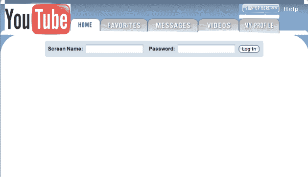
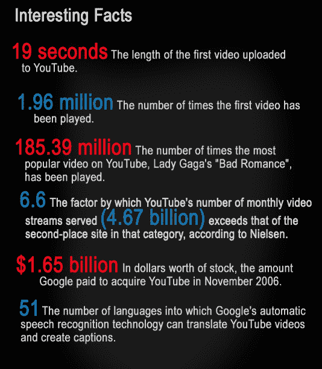

# 五年过去了，YouTube 现在每天有 20 亿的浏览量

> 原文：<https://web.archive.org/web/http://techcrunch.com/2010/05/16/five-years-in-youtube-is-now-streaming-two-billion-videos-per-day/>

很难相信，自从 YouTube 推出并改变了人们在线分享视频的方式以来，已经过去了五年(一年半后，谷歌收购了 T2)。为了庆祝自己的生日，YouTube 刚刚宣布了一个重要的新里程碑:它每天的观看量高达 20 亿次(该公司指出，这是“美国三大电视网黄金时段观众总和的近两倍”)。

为了纪念这一时刻，YouTube 还推出了一个名为“我的 YouTube 故事”的新视频频道，其中包括一系列剪辑，展示了世界各地的人们谈论 YouTube 如何改变了他们的生活。首批片段由纪录片导演斯蒂芬·希金斯拍摄，其中一些片段相当感人。YouTube 用户也可以上传他们自己的视频故事；YouTube 将在全球地图上绘制这些视频，还将提供视频片段的互动时间表。

我们应该指出，2009 年 10 月，YouTube 宣布其日访问量[超过了](https://web.archive.org/web/20230407003416/https://techcrunch.com/2009/10/09/youtubes-new-logo-shouts-from-the-rooftops-1-billion-views-per-day/)10 亿次，但这个数字可能比实际数字要低一点——我们曾在去年 6 月[报告过](https://web.archive.org/web/20230407003416/https://techcrunch.com/2009/06/09/youtube-video-streams-top-1-billionday/)日访问量超过了 12 亿次。

YouTube 还汇编了一些统计数据和时间表，以反映其前五年的情况。

以下是该网站的最新统计数据:

> 一天 20 亿次浏览
> 第三大访问量网站(Alexa)
> 本地化于 23 个国家，使用 24 种不同的语言
> 15 人们每天在该网站上花费的平均分钟数
> 每分钟 24 小时视频上传到 YouTube
> 每天 4500 万主页浏览量**更新:** YouTube 已澄清这是仅在美国每天的浏览量
> 70%的 YouTube 流量来自美国境外
> 每天通过版权管理技术扫描 100 年的视频，内容 ID

以下是 YouTube 分享的其他一些好东西:

**第一个 YouTube 主页，2005 年**

**YouTube 简史**
【YouTube = http://www . YouTube . com/watch？v = X2N _ v2 DFS 1u&color 1 = 0x B1 B1 B1&color 2 = 0x d0 d0 d 0&HL = en _ US&feature = player _ embedded&fs = 1】

**关键里程碑**

第一个[视频](https://web.archive.org/web/20230407003416/http://www.youtube.com/watch?v=jNQXAC9IVRw)上传到网站(2005 年 4 月)
[小罗视频](https://web.archive.org/web/20230407003416/http://www.youtube.com/watch?v=ztRyYMSf0K8)第一个达到 100 万浏览量(2006 年 7 月)
谷歌[收购](https://web.archive.org/web/20230407003416/http://www.youtube.com/watch?v=QCVxQ_3Ejkg)YouTube(2006 年 10 月)
CNN/YouTube [辩论](https://web.archive.org/web/20230407003416/http://youtube-global.blogspot.com/2007/06/announcing-cnnyoutube-debates.html)(2007 年 6 月)
YouTube 移动网站[推出](https://web.archive.org/web/20230407003416/http://youtube-global.blogspot.com/2008/01/new-and-improved-youtube-for-mobile.html)(2008 年 1 月)
YouTube

**产品里程碑**
YouTube 支持在其他网站嵌入内容(2005 年 6 月)
合作伙伴计划发布(2007 年 12 月)
InVideo 广告发布(2007 年 8 月)
内容 ID 发布(2007 年 10 月)
YouTube 高清视频(2008 年 12 月)
节目和电影(2009 年 4 月)
YouTube XL(2009 年 6 月)
YouTube Direct(11 月)

**有史以来点击率最高的 5 个视频**
[Lady Gaga Bad Romance](https://web.archive.org/web/20230407003416/http://www.youtube.com/watch?v=qrO4YZeyl0I)有 196，115，524 次点击率
[Charlie bite my finger](https://web.archive.org/web/20230407003416/http://www.youtube.com/watch?v=_OBlgSz8sSM)有 185，714，255 次点击率
[Evolution of Dance](https://web.archive.org/web/20230407003416/http://www.youtube.com/watch?v=dMH0bHeiRNg) 有 142，679，738 次点击率
[Miley Cyrus–7 件事](https://web.archive.org/web/20230407003416/http://www.youtube.com/watch?v=Hr0Wv5DJhuk)有 117，413，641

**前五大订阅合作伙伴**
[尼加希加](https://web.archive.org/web/20230407003416/http://www.youtube.com/user/nigahiga)拥有 2，186，108 名订户
[弗雷德](https://web.archive.org/web/20230407003416/http://www.youtube.com/user/Fred)拥有 1，721，0095 名订户
[山那多森电视](https://web.archive.org/web/20230407003416/http://www.youtube.com/user/shanedawsontv)拥有 1，486，594 名订户
[斯莫什](https://web.archive.org/web/20230407003416/http://www.youtube.com/user/smosh)拥有 1，461，046 名订户
雷威廉约翰逊拥有 1，223，

