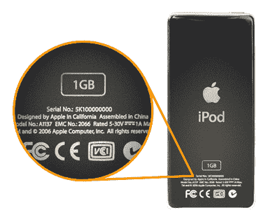

# 五年后，苹果召回第一代 iPod Nano 

> 原文：<https://web.archive.org/web/http://techcrunch.com/2011/11/12/five-years-later-apple-recalls-the-first-generation-ipod-nano/>

# 五年后，苹果召回第一代 iPod Nano

苹果公司发布了对第一代 iPod Nano 的召回，这一举动显示了对客户的极度关心和拖延。不是你当表用的那个，不是胖的那个，也不是圆的那个。原版(在我看来也是最好的)。原来它有一个罕见的过热问题，这些警告通常意味着*爆炸*问题。

实际上只有一家电池供应商受到牵连，而且仅有的几款热门设备仅在 2005 年 9 月至 2006 年 1 月期间上市。所以，如果你在 2005 年的假期里送了或收到了一辆 Nano，最好在它烧毁你的房子之前找到它。

使用此分步指南查找您的序列号:

将该序列输入苹果公司的便捷检查器[，这里是](https://web.archive.org/web/20230204224425/https://supportform.apple.com/201110/)，如果它是一个坏批次，但在过去五年中不知何故奇迹般地没有熔化(过热/灾难性爆炸的可能性“随着电池老化而增加”)，苹果公司将发给你一个替换品。六周后。

在其他新闻中，苹果仍然有原始的 iPod Nanos 作为替代品发行。非常聪明——或者他们一直都知道这件事？

[通过 [SlashGear](https://web.archive.org/web/20230204224425/http://www.slashgear.com/original-ipod-nano-recalled-by-apple-in-usa-12194930/)