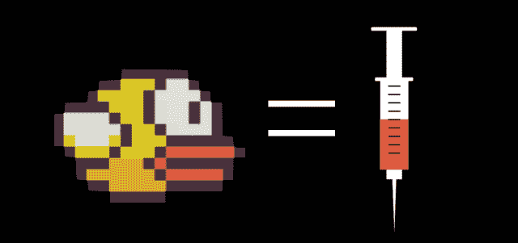

# Flappy Bird 开发者称他将于明天关闭这款热门游戏 TechCrunch

> 原文：<https://web.archive.org/web/https://techcrunch.com/2014/02/08/flappy-bird-going-down/>

# Flappy Bird 的开发者称他将在明天关闭这款热门游戏

流行手机游戏 Flappy Bird 的开发者刚刚宣布，他将在明天关闭这款游戏。

越南河内的独立游戏开发商 Dong Nguyen 在推特上写道:“对不起‘Flappy Bird’用户，22 小时后，我将关闭‘Flappy Bird’。我再也受不了了。”他接着[阐述](https://web.archive.org/web/20230209190751/https://twitter.com/dongatory/status/432228383095668737)，“这不是任何与法律有关的问题。我只是不能再保留它了。”

在他的推文首次发出后，其他人[问他是否愿意出售它，但](https://web.archive.org/web/20230209190751/https://twitter.com/adrianbye/status/432228562809016320)[他说不](https://web.archive.org/web/20230209190751/https://twitter.com/dongatory/status/432233975797383168)。阮还说他还在做游戏。

TechCrunch [在 Flappy Bird 起飞后的一周前通过电子邮件](https://web.archive.org/web/20230209190751/https://techcrunch.com/2014/02/01/developer-behind-flappy-bird-the-impossible-game-blowing-up-the-app-store-says-he-just-got-lucky/)采访了 Nguyen(Flappy Bird 仍然是苹果应用商店和 Google Play 中排名第一的免费应用)。他说他是他游戏工作室的唯一创作者。GEARS ，他似乎和其他人一样对 Flappy Bird 的受欢迎程度感到惊讶，告诉我们，“除了上传游戏，我没有资源做其他事情。”

我已经发邮件给 Nguyen 了解更多信息，如果有回音，我会更新这个帖子。据推测，如果你已经下载了这个游戏，你就可以继续玩下去，但是，这一点我还没有和 Nguyen 确认。

正如 Kotaku 中提到的，Nguyen [本周早些时候说媒体“高估”了他的游戏的成功:“这是我从来不想要的。请给我安宁。”](https://web.archive.org/web/20230209190751/https://twitter.com/dongatory/statuses/430756876582535168)

—

*还想要更多？读[《一个瘾君子的自白》](https://web.archive.org/web/20230209190751/https://techcrunch.com/2014/02/08/the-only-way-to-win-is-not-to-play/)*

