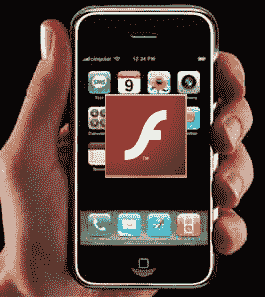

# Flash 好像要来 iPhone 了。但这是好事吗？

> 原文：<https://web.archive.org/web/https://techcrunch.com/2008/09/30/flash-seems-to-be-coming-to-the-iphone-but-is-that-a-good-thing/>

# Flash 好像要来 iPhone 了。但这是好事吗？

当 iPhone 首次发布时，有很多人猜测这款手机缺乏 Flash 支持是否会削弱其浏览器，并给我们带来比苹果承诺的“真正的网络”更少的东西。当时，史蒂夫·乔布斯解释说，Flash 的完整版本在 iPhone 上运行不太好(iPhone 运行在 ARM11 芯片上，这与 Flash 不兼容)，但 Adobe 的移动 Flash 缺乏功能性——他希望在苹果考虑将 Flash 放在 iPhone 上之前，在中间有一个[产品。](https://web.archive.org/web/20221006100523/http://www.beta.techcrunch.com/2008/03/05/adobes-flash-not-good-enough-for-steve-jobs/)

今天在沙滩上的 Flash(FOTB)会议上，Adobe 已经[证实](https://web.archive.org/web/20221006100523/http://www.techmeme.com/080930/p74#a080930p74)这样一个应用程序正在开发中(之前有猜测说它存在，~~但是两家公司都没有官方消息~~ Adobe 之前[宣布](https://web.archive.org/web/20221006100523/http://www.beta.techcrunch.com/2008/06/17/adobe-breakthrough-flash-working-on-the-iphone-in-the-labs-on-an-emulator-oh-well/)它有一个版本可以在模拟器上工作)。Adobe 高级工程总监 Paul Betlem 宣布了这一消息，称“我的团队正在 iPhone 上开发 Flash，但这是一个封闭的平台。”

Betlem 坚持认为 iPhone 是一个封闭的平台，这意味着 Adobe 最终无法控制 Flash 是否会出现。这可能是严格正确的，但如果 Adobe 没有合理的预期苹果会在满足乔布斯的预期后包括它，那么它不太可能首先开始 iPhone 插件的工作。

听起来闪电侠就要出现了。但是我们真的想要吗？

如今，我们大多数人使用 Flash 主要是为了浏览 Hulu、YouTube 和 CNN 等网站上的视频。iPhone 上的 Flash 可能会让我们访问所有这些网站(假设它的 CPU 可以处理视频)，但我更希望看到类似于 YouTube 所创建的这些媒体中心的本地应用程序。众所周知，Flash 是 CPU 密集型的，这是 iPhone 在电池寿命已经疲软的情况下最不需要的东西——原生应用程序将允许在手机的 Quicktime 播放器上播放 H.264 视频，这可能只需要很少的 CPU 周期。

Flash 的其他问题出现在更标准的网站上。基于 Flash 的网站可能很有趣，也很有创意，但它们往往效率低下，导航起来也不必要的困难(见 [Chipotle](https://web.archive.org/web/20221006100523/http://www.chipotle.com/) 主页就是一个很好的例子)。最后，还有对基于 Flash 的广告的担心，这可能会令人难以置信地侵扰。

除了这些问题，Flash 仍然在网络上扮演着不可或缺的角色，没有什么比尝试观看纯 Flash 视频剪辑被拒绝更令人沮丧的了。为了完整性起见，苹果应该包括 Flash，同时鼓励网络开发者在他们的移动网站上少用 Flash。