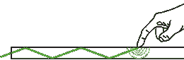
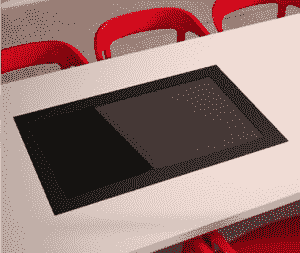

# FlatFrog 推出新的多点触控桌子 

> 原文：<https://web.archive.org/web/https://techcrunch.com/2012/01/31/flatfrog-offers-up-a-new-multitouch-table/>

我们在 CES 上看到了一些触摸桌子，虽然[表面](https://web.archive.org/web/20230209125243/https://techcrunch.com/tag/surface/)仍然是黄金标准，但并不是每个人都喜欢它的价格、外形或尺寸。这里有竞争的空间，总部在瑞典的 [FlatFrog](https://web.archive.org/web/20230209125243/http://flatfrog.com/) 希望凭借一款新的 32″设备打入市场。

说到触摸，有几种不同的方法来检测手指和物体。现在最常见的是电容式，大多数智能手机上都有。然后是电阻性的，响应不太灵敏。三星为新的 Surface 设计了一个，在图像像素之间嵌入了微型光电传感器。扁蛙使用了另一种方法。

它被称为平面散射检测，以前也使用过，尽管据我所知没有如此大规模的使用。它包括通过成像表面上的薄层传播光(我猜是红外线)。当物体接触该表面时，光的传播被中断，并且可以检测到这种中断的位置。我知道微软在几年前我在他们的实验室看到的一个[多点触控鼠标](https://web.archive.org/web/20230209125243/https://techcrunch.com/2009/10/05/microsofts-insane-new-multi-touch-mice-demoed-on-video/)中使用了这个版本；他们称之为它的专有名称，沮丧全内反射，但 FlatFrog 已经为他们的版本申请了专利，并重新命名。

其结果是，您拥有电容式的响应能力和相对简单性，以及表面等物体的更广泛检测能力。你可以用刷子，触笔，或者戴手套的手来操作这个东西。这是他们的小卷轴:

[维梅奥·http://vimeo.com/35561018 w = 640]

它本质上是一个多点触控套件，而不是一个集成的解决方案，这意味着他们可以使用 OEM 厂商提供的漂亮、轻薄的普通 1080p 显示器，这也有助于降低价格。几年前，我们在 CES 上看到了现有电视的红外装置，所以这个概念不是新的，但他们的平面散射检测技术可能比我们之前看到的相当黑客的解决方案更实用一点。

显示器本身是 1080p 32 英寸的，厚度只有 55 毫米，适合嵌入。它可以一次处理几十个触摸，只有 8 毫秒的延迟，这是更便宜的电容显示器肯定做不到的。我们在维加斯看到一些便宜的餐馆展示菜单，那真是太糟糕了。FlatFrog 的解决方案看起来肯定要好得多。

不过，它只是一个触摸台，而不是像 Surface 那样的完整平台，所以你必须将它连接到 Windows 7 机器上，才能给它信号和输入。