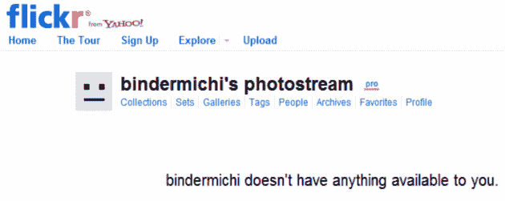

# Flickr 意外删除账户:五年时间和 4000 张照片付之东流 TechCrunch

> 原文：<https://web.archive.org/web/https://techcrunch.com/2011/02/02/flickr-accidentally-wipes-out-account-five-years-and-4000-photos-down-the-drain/>

# Flickr 意外删除了账户:五年时间和 4000 张照片付之东流

雅虎的 Flickr 可能面临另一场公关噩梦。IT 架构师和 Flickr 用户 [Mirco Wilhelm](https://web.archive.org/web/20230202234510/http://www.facebook.com/mirco.wilhelm) 昨天无法登录他的 [5 岁的账户](https://web.archive.org/web/20230202234510/http://www.flickr.com/photos/bindermichi)，当他向 Flickr 团队询问这个问题时，他们直截了当地告诉他，他们[不小心冲走了](https://web.archive.org/web/20230202234510/http://bindermichi.posterous.com/you-have-to-fucking-kidding-yahoo)他的整个账户，以及其中的[4000 张照片](https://web.archive.org/web/20230202234510/http://thomashawk.com/2011/02/did-flickr-accidentally-delete-mirco-wilhelms-account.html)。

显然，威廉上周末向该公司报告了一名 Flickr 用户的账户中有“明显被盗的资料”，但一名工作人员错误地焚烧了他的账户，而不是罪犯的账户。

> 你好，
> 
> 不幸的是，我把账户搞混了，不小心把你的删除了。我为这个严重的错误感到非常抱歉，并希望这个错误能够得到纠正。我在这里可以做的是:
> 
> 我可以恢复您的帐户，尽管我们无法检索您的照片。我知道你的账户有很多历史，请再次接受我对我的疏忽的道歉。一旦我恢复您的帐户，我将添加四年的免费专业版，以弥补我的错误。
> 
> 如果还有什么我能做的，请让我知道。再次为这个错误表示深深的歉意。
> 
> 问候，
> 
> Flickr 员工

哎哟。

这个故事最让我惊讶的是威廉对他的账户终止的平静反应:

> 免费获得额外的 4 年服务订阅是一件好事…但是我已经通过参加一些活动和比赛获得了下一年的免费专业订阅。
> 
> 那么，这怎么能真正补偿我网络相册中丢失的近 4000 张“链接”图片呢？我必须手动重新创建这些链接，这将花费我数周甚至数月的空闲时间！更不用说，链接了这些图片的外部网站(包括一些官方的雅虎！和 Flickr 博客)。
> 
> …
> 
> 因为 Flickr 已经删除了所有相关对象上的账户，他们不能再激活账户本身，给我留下了一个空壳，里面是我在过去 5 年里做的事情。如果我有一个免费账户，这是可以接受的。但是因为我是一个付费的顾客，我希望得到的不仅仅是一句“再次，我为这个错误深感抱歉。”
> 
> 我希望至少有一个过程可以消除这种错误。对于任何其他形式的补偿，我会花一些时间来咨询。

我从来都不是 Flickr 的大用户，但我一直认为简单的点击按钮并不能完全删除一个帐户及其内容，而不是简单地停用它。

我从来没有想到，如果结果证明是一个错误，团队成员可以删除帐户，而没有重新激活它们的方法。

看在上帝的份上，备份怎么办？

值得一提的是，Flickr 的扎克·谢泼德[在 Flickr 论坛上这样评论](https://web.archive.org/web/20230202234510/http://www.flickr.com/help/forum/en-us/72157625954981158/page2/#reply72157625832415237):

> 我们一直致力于恢复账户的能力，希望能在今年年初完成。
> 
> 我们已经和 Mirco 取得了联系，也许可以恢复他的账户。到目前为止所做的部分工作可能会使检索帐户成为可能。这只是一个可能，但是我们想尽我们所能来纠正这个错误。
> 
> 正如人们在上面所说的，我们也相信这是一个重要的特性，在出现错误的情况下可以使用。正如你们中的许多人所知道的，我们通常不会在新特性发布前讨论它们，但是由于社区的关注，我们想让你们知道这一点。

所以基本上自从公司成立以来，Flickr 还没有办法恢复意外删除的付费账户，也许他们可以对 Mirco 的账户做点什么(你一定想知道如果他没有在第一时间提出这个[大丑闻](https://web.archive.org/web/20230202234510/http://www.observer.com/2011/tech/flickr-accidentally-deletes-users-4000-photos-and-cant-get-them-back)会发生什么),用户应该很幸运，Flickr 让他们知道他们可能能够在未来的某个时候恢复错误终止的账户。

注意到了。

**更新**:雅虎发出如下回应:

> 昨天，由于人为失误，Flickr 误删了一个会员的账号。Flickr 非常重视用户的信任，我们和我们的用户一样，对能够拍摄、发布和分享照片感到非常自豪。我们的团队正在与该成员联系，目前正在努力恢复他的帐户内容。此外，我们为会员提供 25 年的免费 Flickr Pro 会员资格。我们还在积极开发一个程序，让我们可以轻松恢复被删除的帐户，并将很快推出这一功能。

**更新二:**

> 雅虎！很高兴与大家分享，Flickr 团队已经完全恢复了昨天被错误删除的会员帐户。我们对导致错误的人为错误感到抱歉，并已努力纠正这种情况，包括重新加载整个照片组合，并为该成员提供 25 年的免费 Flickr Pro 会员资格。Flickr 非常重视我们成员的信任，我们感谢这位成员和我们的社区所表现出的耐心。Flickr 也将很快推出功能，让我们在未来更容易恢复被删除的帐户。