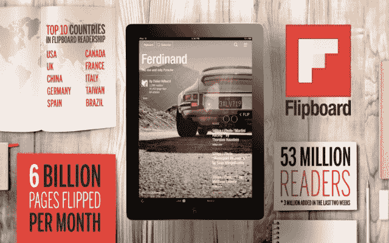

# 自推出个性化杂志以来，Flipboard 增加了 300 万用户，迄今已创建超过 50 万份杂志 

> 原文：<https://web.archive.org/web/https://techcrunch.com/2013/04/11/flipboard-adds-3-million-users-since-launch-of-personalized-magazines-over-500000-magazines-created-to-date/>

# 自推出个性化杂志以来，Flipboard 增加了 300 万用户，迄今已创建了超过 50 万份杂志

移动杂志 [Flipboard](https://web.archive.org/web/20221226015612/http://flipboard.com/) 今天透露，自从[在](https://web.archive.org/web/20221226015612/https://techcrunch.com/2013/03/26/the-new-flipboard-lets-you-create-your-own-mobile-magazine-adds-search-etsy-and-more/)前两周推出新功能以来，已经有超过 50 万本个性化杂志在其平台上被创建。在此期间，该公司还为其服务增加了 300 万新用户，使其用户总数达到现在的 5300 万。

3 月下旬，[这家初创公司为其用户推出了一种除搜索、发现、阅读和分享到社交网络之外的其他方式](https://web.archive.org/web/20221226015612/https://techcrunch.com/2013/03/26/the-new-flipboard-lets-you-create-your-own-mobile-magazine-adds-search-etsy-and-more/)——它基本上将其所有观众都变成了杂志编辑。现在，Flipboard 从世界各地的出版商那里收集的内容的每个故事都附带了一个“翻转”选项，任何人都可以创建个性化的主题杂志，其他读者可以直接在 iOS 或 Android 应用程序中订阅。

Flipboard 表示，现在超过 50%的用户每天都在阅读这些个性化的杂志。其中一些是出版商自己创作的，一些更受欢迎的来自《时尚先生》、《滚石》、《玛莎·斯图尔特生活》、《国家地理》等。与此同时，用户创建的杂志也很受欢迎——例如，TechCrunch 撰稿人 MG Siegler 的“阅读清单”杂志在最受欢迎的榜单上排名第三。

Flipboard 指出，一本非常多产的杂志“现代绅士的游乐场”已经增加了 2495 个项目。不足为奇的是，BuzzFeed 上有一篇最有趣的文章——“28 个令人难以置信的美丽地方，你不会相信它们真的存在。我很确定网上的每个人都读过。(我觉得我看了三遍，就像永不失效的 linkbait！)当然，这些文章的图片内容反映了 Flipboard 读者浏览高度视觉化图片文章的倾向。

Flipboard 中的分享模式也很有趣。显然，该杂志正在转变为一种晨报，用户在上午 9 点左右阅读最多，而杂志创作发生在下午(下午 1 点)，分享高峰在晚上(晚上 7 点)。你几乎可以看到内容创作到消费过程的流动，从阅读内容开始，然后杂志创作者为小众读者策划文章，最后导致那些在社交网络上进一步传播内容的人。

哦，至于当初制作内容的人？嗯，我们只是一直在工作。不客气