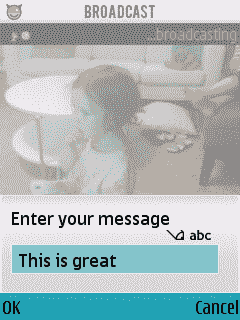
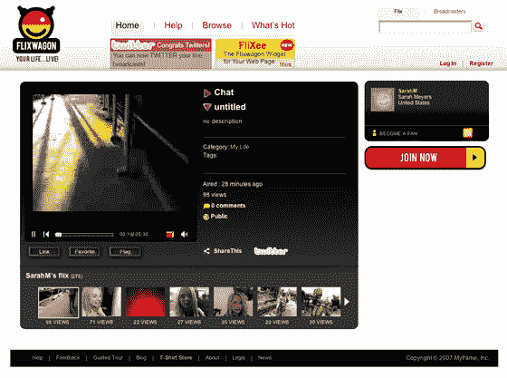

# Flixwagon 的移动广播现已公开 

> 原文：<https://web.archive.org/web/https://techcrunch.com/2008/07/08/flixwagon-releases-open-public-version-and-new-features/>

# Flixwagon 的移动广播现已公开

移动流媒体服务提供商 Flixwagon 在其发布之际增加了一系列新功能。

在新功能中，用户现在可以通过[诺基亚塞班 60 系列](https://web.archive.org/web/20230121135630/http://www.s60.com/)手机浏览器注册和下载客户端软件。在广播之前，用户可以指定是提高视频质量还是减少延迟。有了新的双向文本聊天，广播公司可以从他们的移动设备向广播期间出现的评论区写回消息。他们还可以在广播期间更改标题视频，并享受数字放大和缩小。

广播后功能包括群组共享选项，广播公司可以指定要与哪些群组(朋友、家人、同事等)共享视频。).他们还可以向 [Twitter](https://web.archive.org/web/20230121135630/http://www.twitter.com/) 和 [YouTube](https://web.archive.org/web/20230121135630/http://www.youtube.com/) 发布个性化信息。

Flixwagon 网站的变化包括为用户的广播订阅添加 RSS，以及从 Gmail、Yahoo、Plaxo 等网站导入联系人的选项。

Flixwagon 是第一个宣布支持 iPhone 的流媒体服务。它与 [Qik](https://web.archive.org/web/20230121135630/http://www.qik.com/) 和 [Kyte.tv](https://web.archive.org/web/20230121135630/http://www.kyte.tv/) 竞争最为直接(此处见罗伯特·斯科博对移动视频广播领域的分析[)。](https://web.archive.org/web/20230121135630/http://techcrunch.com/2008/06/14/why-kytetv-will-kill-qik-and-flixwagon-in-cell-phone-video-space/)

