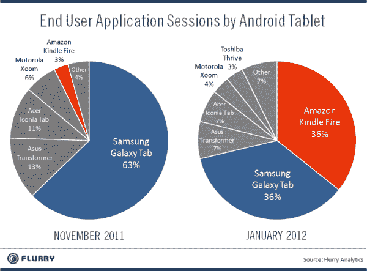
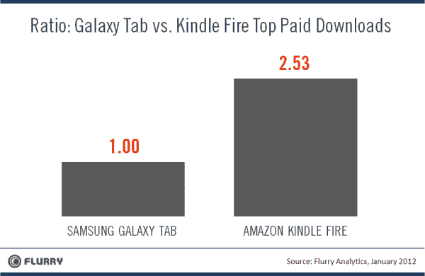

# 乱舞:亚马逊的 Kindle Fire 已经开始吞噬三星的 Galaxy Tab 

> 原文：<https://web.archive.org/web/https://techcrunch.com/2012/01/27/flurry-amazons-kindle-fire-is-already-starting-to-smoke-samsungs-galaxy-tab/>

# 乱舞:亚马逊的 Kindle Fire 已经开始吞噬三星的 Galaxy Tab

哦，三星——最好小心你的尾巴。虽然苹果可能没有看到 Kindle Fire 的推出对 iPad 销售的任何影响(无论是正面还是负面),但三星的 Galaxy Tab 应该会感受到压力。

Flurry [利用他们的应用分析平台提供的数据(他们估计该平台已经进入了大约 90%的安卓设备)，强调了一些令人惊讶的数字](https://web.archive.org/web/20230209233821/http://blog.flurry.com/bid/81151/Amazon-Lights-the-Android-World-on-Fire)。

**App Sessions:**

这一项非常有趣，因为它测量了有多少人实际上在使用他们各自的 Android 平板电脑(相对于有多少人买了这些平板电脑并把它们放在架子上)。它衡量“用户应用程序会话”，即用户打开一个应用程序并使用至少 10 秒钟后再关闭它。

Kindle Fire 在 11 月推出后，仅占应用程序会话的 3%。仅仅三个月后，它的市场份额为 35.7%，与三星的 35.6%不相上下。

想想吧。Kindle Fire 已经推出了 3 个月，其累计使用量相当于一系列已经推出了整整一年的设备。即使 Galaxy Tabs 的销量远远超过 Kindle Fires 的销量(很可能是这样——再说一次，Tab 系列已经问世很久了。它在世界各地都可以买到，而 Fire 目前只在美国有售)，Fire 所有者似乎实际上更经常地使用他们的设备。

**下载量:**

接下来，Flurry 研究了安卓市场和亚马逊应用商店下载量前十的 5 款应用。总结一下:对于 Galaxy Tab 用户来说，每卖出一款顶级应用，Kindle Fire 用户就能卖出 2.53 款。再一次，想想 Galaxy Tab 的受众有多大(Flurry 估计至少是两倍)——然而，Kindle Fire 用户购买的更多。

如果你是一名 Android 开发者，不知道是否应该瞄准 Kindle Fire 和亚马逊的应用商店，答案似乎是非常明确的“是”