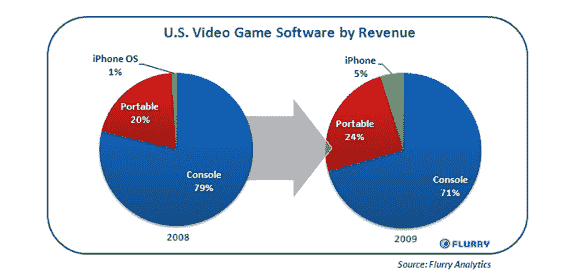
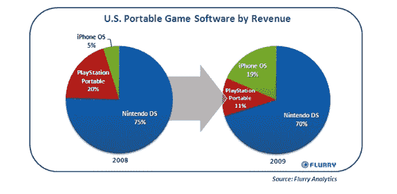

# Flurry: iPhone 游戏在美国是一个价值 5 亿美元的产业，并且正在占据市场份额

> 原文：<https://web.archive.org/web/http://techcrunch.com/2010/03/22/flurry-iphone-games-500-million/>

# Flurry: iPhone 游戏在美国是一个价值 5 亿美元的产业，并且正在占据市场份额

如果你看看 iTunes 应用商店中付费和票房最高的应用，游戏类别占据主导地位。人们为游戏付费，但是他们到底付了多少钱？今天晚些时候，移动应用分析公司 [Flurry](https://web.archive.org/web/20230403105422/http://www.flurry.com/) 发布的一份新报告对 iPhone/iPod Touch 视频游戏行业进行了统计。Flurry 估计，2009 年美国通过 App Store 销售的游戏价值为 5 亿美元，高于 2008 年的 1.15 亿美元。与整个美国游戏机和便携式视频游戏市场相比，iPhone/iPod Touch 现在只占视频游戏总销售额的 5%。(这些数字包括 PlayStation 和 Xbox 等主机游戏，但不包括网络或社交游戏)。游戏占 Flurry 2009 年美国应用商店 13.6 亿美元总收入的 37%。

仅在便携式视频游戏市场，数字就更加惊人。iPhone 和 iPod Touch 正在对索尼 PSP 和任天堂 ds 构成严重威胁。运行在 iPhone OS 上的游戏从 2008 年便携式游戏收入的 5%上升到 2009 年的 19%。去年，iPhone OS 从 PSP 那里夺走了 9 个百分点的软件收入市场份额(从 20%到 11%)，从任天堂 DS 那里夺走了 5 个百分点(从 75%到 70%)。它正在吞噬便携式游戏市场。

iPhone 上有 30，000 个游戏，并且还在增长。如果你是一名游戏玩家，并且已经拥有一部 iPhone，你必须非常专注于随身携带 PSP、任天堂 DS 或其他一些单一用途的游戏机。说到手机游戏，功能齐全的通用电脑手机是无可匹敌的。

