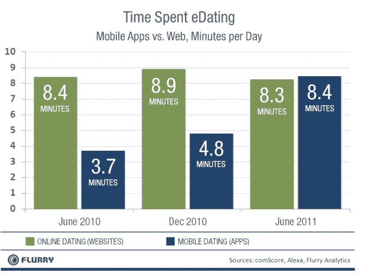
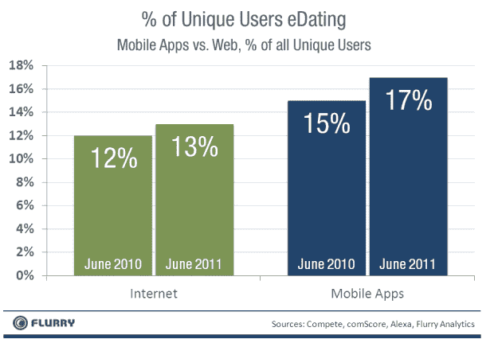

# 乱舞:手机约会应用比在线网站捕捉更多调情时间 

> 原文：<https://web.archive.org/web/http://techcrunch.com/2011/08/02/flurry-mobile-dating-apps-capture-more-flirting-time-than-online-sites/>

# 乱舞:手机约会应用比在线网站捕捉更多调情时间

移动应用分析公司 Flurry[今天发布了一份报告](https://web.archive.org/web/20230204203421/http://blog.flurry.com/bid/68668/Mobile-Dating-Apps-The-Second-Lady-Killer-App-Category)，调查了移动约会应用和在线约会网站的使用情况。Flurry 使用 Compete、comScore 和 Alexa 的数据来衡量约会网站的互联网消费，并使用自己的分析数据(现在跟踪超过 90，000 个移动应用程序)进行移动跟踪。在约会方面，Flurry 跟踪了一大批约会应用，用户总数超过 200 万。

Flurry 报告称，与在线约会网站相比，移动约会应用需要更多的时间。平均而言，花在手机约会应用上的时间为 8.4 分钟，而花在网上的时间为 8.3 分钟。一年前，人们在互联网上约会的时间是现在在移动应用上的两倍。移动约会应用的使用时间从 2010 年 6 月的 3.7 分钟增长到 2011 年 6 月的 8.4 分钟。这进一步证明了 Flurry 最近关于移动应用使用情况的报告主导了 T4 的网络浏览。

在参与度方面，Flurry 表示，消费者检查移动约会应用的频率有助于每天花在移动约会应用上的时间的增长。去年，普通用户每天打开约会应用 2 次，每次不到 2 分钟。现在，消费者每天打开约会应用超过 5 次，但时间较短，每次约 1.5 分钟。

就访问网站和移动应用的独立用户而言，Flurry 发现，按比例来说，使用智能手机上的约会应用的人比访问在线约会网站的人多。Flurry 通过观察每个平台上约会服务的独立用户占总用户的比例来衡量这一点。对于互联网，Flurry 比较了在线约会网站的独立访客与使用互联网的总人数，这两个数字在 2010 年 6 月和 2011 年 6 月分别为 12%和 13%。对于移动应用程序，Flurry 比较了移动约会应用程序和所有应用程序的独立用户，结果在 2010 年 6 月和 2011 年 6 月分别为 15%和 17%。

该报告显示，使用约会应用程序的人数比使用所有应用程序的人数增长更快。总体而言，所有应用程序的独立用户数量同比增长了 125%，而同期使用移动约会应用程序的独立用户数量增长了 150%。

作为背景，Flurry 发现排名靠前的约会应用和网站是 Match.com、eHarmony、PlentyOfFish、Zoosk、Jazzed 在线约会、Skout 和 Grindr。

考虑到这些数据，似乎在移动约会以及整合本地和基于位置的功能方面存在巨大的市场机会。这是一种趋势，像 [LikeALittle](https://web.archive.org/web/20230204203421/https://techcrunch.com/2011/08/01/likealittle-people-uses-your-interests-to-connect-with-the-people-around-you/) 这样的初创公司已经抓住了这一趋势。

