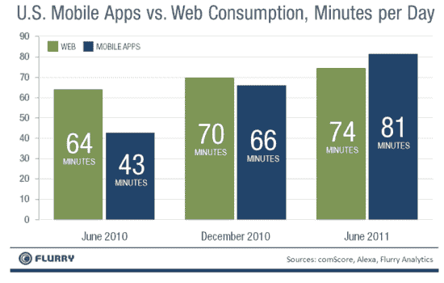
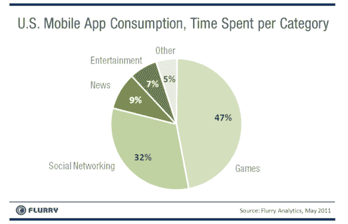

# Flurry:花在移动应用上的时间已经超过了网页浏览

> 原文：<https://web.archive.org/web/https://techcrunch.com/2011/06/20/flurry-time-spent-on-mobile-apps-has-surpassed-web-browsing/>

# Flurry:花在移动应用上的时间已经超过了网页浏览

移动应用分析公司 Flurry[今天发布了一份新报告](https://web.archive.org/web/20230203093350/http://blog.flurry.com/bid/63907/Mobile-Apps-Put-the-Web-in-Their-Rear-view-Mirror)，比较了智能手机用户在移动应用上的日常参与度和在 PC 上的网页浏览。对于网络分析，Flurry 使用了 comScore 和 Alexa 的数据，而对于移动应用程序的使用，这家初创公司使用了自己的分析，现在每天有超过 8.5 万个应用程序的 5 亿次匿名使用会话。Flurry 表示，这大约占所有移动应用程序活动的三分之一。虽然这是一种不完美的方法，但它确实表明了移动应用在我们生活中的崛起。

Flurry 表示，每天花在移动应用上的时间已经超过了网络消费。现在，普通用户使用移动应用的时间比使用互联网的时间多 9%。六月份，用户平均每天花 81 分钟在移动应用上，相比之下，花 74 分钟在网络上。

相比之下，2010 年 12 月，人们每天花在手机应用上的时间为 66 分钟，花在网络上的时间为 70 分钟。今年 6 月，普通用户每天使用移动应用的时间不到 43 分钟，而使用互联网的时间平均为 64 分钟。

Flurry 表示，移动应用使用量的增长是每个用户一天中更多会话的结果，而不是会话长度的增加。所以基本上，用户更频繁地查看 Twitter 和 Foursquare，而不是在任何给定的会话中花更多的时间在应用上。

Flurry 还深入调查了移动应用用户的时间使用情况。Flurry 从 2011 年 5 月开始，记录了它跟踪的所有应用程序(超过 85，000 个)在每个类别上花费的时间。游戏和社交网络类别占据主导地位，分别占消费者每日花费时间的 47%和 32%。这两个类别总共控制了消费者 79%的应用时间。花在新闻应用上的时间占 9%，娱乐占 7%。

Flurry 没有包括花在移动网络上的时间的信息，与花在电脑上浏览网页的时间相比，我也觉得这很有趣。但是上面的统计数据无疑将脸书的[移动战略和斯巴达项目](https://web.archive.org/web/20230203093350/https://techcrunch.com/2011/06/17/we-will-fight-in-the-shade/)放在了背景中。随着智能手机的使用继续增长，我们将看到更多的科技公司追求积极的移动战略。归根结底，在用户参与度方面，谁将分得更大的一块蛋糕。

