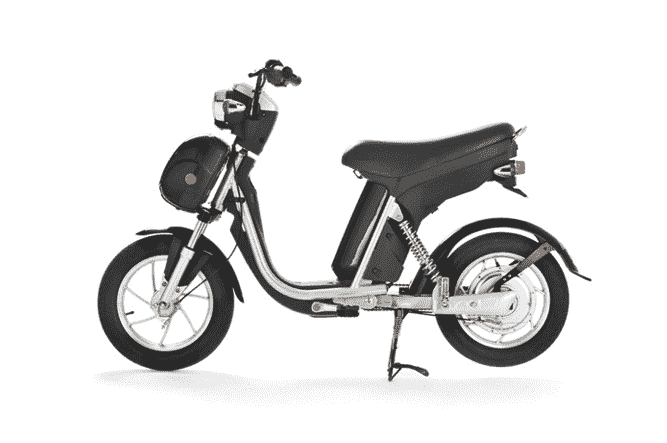

# FlyKly 电动自行车来到旧金山 TechCrunch

> 原文：<https://web.archive.org/web/http://techcrunch.com/2011/08/23/flykly-electric-bikes-are-coming-to-san-francisco/>

# FlyKly 电动自行车来到旧金山

电动自行车制造商 [FlyKly](https://web.archive.org/web/20230205003326/http://flykly.com/) 将[的时尚、强劲且环保的自行车带到三藩市，今年夏天早些时候在三藩市举行了盛大的发布会。该公司于 6 月 20 日开业，7 月份在 Soho 区的一家弹出式商店销售一空。现在，这种自行车在旧金山可以买到。](https://web.archive.org/web/20230205003326/http://blog.flykly.com/?attachment_id=224)

不过，将这些东西称为“自行车”似乎有些奇怪——这个词让人联想到车把上的彩带和绑在车头的柳条篮。相反，这些“自行车”看起来更像滑板车。但是由于自行车时速不超过 20 英里，你不需要驾照就可以驾驶它们。

[")](https://web.archive.org/web/20230205003326/https://techcrunch.com/wp-content/uploads/2011/08/modern_big_02-1.jpg)

新自行车有两种设计:[老式](https://web.archive.org/web/20230205003326/http://flykly.com/index.php/vintage.html)和[现代](https://web.archive.org/web/20230205003326/http://flykly.com/index.php/modern.html)，每一款都配备 100%电动锂离子电池。FlyKly 说，只需 1 美元的电，你就可以骑 1000 英里，每次充电 40 英里。(电池只需几个小时就能充满电。)电池也是可拆卸的，所以你可以在任何你想去的地方充电。如果电池耗尽，你可以手动踩踏板继续行驶。

像普通自行车一样，FlyKly 自行车可以停放和拴在围栏柱子、自行车架、人行道和为自行车提供空间的停车库。停车时，转向柱和后轮被锁定。为了以防万一，自行车还包括一个 GPS 跟踪系统，当你不在车上时，如果它开始移动，它可以定位你的自行车。

哦，如果你想知道，“Kly”是一个希腊单词，意思是“恒定的能量或运动。”

FlyKly 以 1900 美元的价格出售这款自行车，在美国运输是免费的。你可以在该公司的网站上了解更多关于这款自行车的信息:[www.flykly.com](https://web.archive.org/web/20230205003326/http://flykly.com/)。