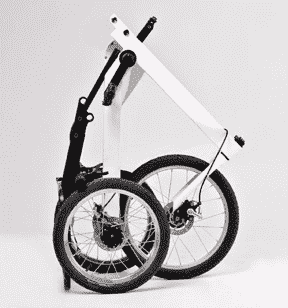

# 折叠式电动维也纳自行车有点傻，但很实用 

> 原文：<https://web.archive.org/web/http://techcrunch.com/2011/08/01/folding-electric-vienna-bike-is-dorky-but-practical/>

# 折叠式电动维也纳自行车有点傻，但很实用

美国尚未加入世界其他国家大规模部署电动自行车的行列，我怀疑这一特定项目会改变这一点，但当像这样一辆漂亮、实用的车辆出现时，它总是值得注意的。这款自行车被称为维也纳自行车，由维也纳设计工作室 [Pixstudio](https://web.archive.org/web/20230203084035/http://pixstudio.net/) 的 Valentin Vodev 设计。

其狭窄的(仅 35 厘米宽)三轮车框架意味着后部负载的额外稳定性，同时仍提供自行车般的操控。后面的平台延伸，有一个有趣的六边形豆荚，适合存放杂货，头盔，或者——显然是树。

有一个电动马达可以独立推动它，或者你可以设置为踏板辅助。Pixstudio 声称这款自行车充电一次可以行驶 60 公里，尽管我推测这是在没有货物和维也纳大小的乘客愿意骑一会儿的情况下。另一个消息来源说 40-60 英里，这显然更多——所以他们可能还不太确定。

除了 30 或 60 英里的范围，适合一天的跑腿，它还可以折叠起来存放，如你在右边看到的。就像我说的，实用，对吧？如果它不太重，它可以很容易地被带到一个公寓的一个或两个步骤。说，*我的*公寓。

维也纳自行车似乎是工作室的[“Biquattro”原型](https://web.archive.org/web/20230203084035/http://pixstudio.net/transportation.html)的演变，经过升级、平滑和喷漆，产生了新版本。它还不能购买，只是今天在普利司通的生态拉力赛上以“工作原型”的形式向公众展示。

[via [MocoLoco](https://web.archive.org/web/20230203084035/http://mocoloco.com/archives/024695.php)