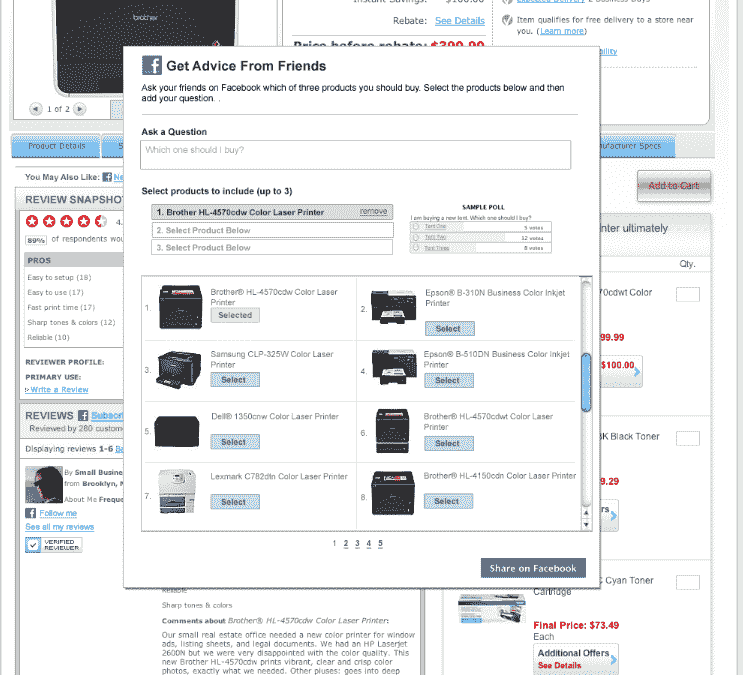

# 通过 power reviews TechCrunch 关注脸书订阅源中的产品和评论者

> 原文：<https://web.archive.org/web/http://techcrunch.com/2011/09/09/follow-products-and-reviewers-in-your-facebook-feed-with-powerreviews/>

# 使用 PowerReviews 关注脸书订阅源中的产品和评论者

当谈到在网上销售产品时，一个产品吸引的消费者评论越多，它看到的转化和销售就越多。这就是为什么 [PowerReviews](https://web.archive.org/web/20230203123341/http://www.powerreviews.com/) 建立了一个社交商务网络，在包括 Staples.com、Gap.com 和 ToysRUs.com 在内的 5500 个网站上有超过 2300 万条评论。今天，PowerReviews 宣布推出两款脸书产品，允许品牌和零售商利用社交网络作为平台，通过使在线购物和产品发现过程更加社会化来推动销售。

PowerReviews 的第一个新产品“脸书发现”使消费者能够围绕特定的产品、类别和评论进行对话，并将它们直接推送到他们的新闻订阅源中，希望为病毒式营销创造机会，而不是垃圾邮件。脸书发现的用户还可以关注感兴趣的特定评论者，以便他们未来的所有评论都发布到他们的墙上，或者他们可以选择接收每日产品评论中的趋势产品新闻，或者通过问题或投票询问朋友朋友他们应该选择什么产品。

这家初创公司今天推出的第二款产品“脸书社区”，为品牌和零售商提供了在客户中培养社区的机会——无论是在产品上还是在他们的脸书粉丝页面上。在品牌营销方面，脸书社区允许品牌奖励他们的大使，同时在社区中分享反馈和建议。该产品还让品牌能够查看前 100 名评论者，以确定他们最活跃的大使和支持者。

更重要的是，消费者可以将他们的脸书个人资料与他们的评论联系起来，创建一个 suped up，uber 个人资料，旨在为他们的朋友和其他购物者提供身份，并增加可信度。他们的脸书概况到他们的评论，创造了丰富的现场概况。这对其他购物者来说增加了他们评论的可信度。[正如 Erick 在 PowerReviews](https://web.archive.org/web/20230203123341/https://techcrunch.com/2011/07/26/powerreviews/) 的上一篇报道中所写的，社交分享对企业来说是一个很大的帮助，因为每股价值 15.72 美元的增量销售。

迄今为止，PowerReviews 已经从各种风险投资和天使投资中筹集了超过 3700 万美元的外部投资，包括 Menlo Ventures、雷曼兄弟和 Draper Richards。

