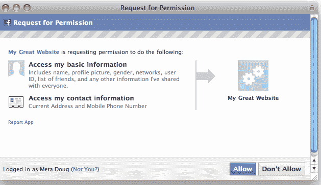

# 投诉后，脸书暂停地址和号码共享 

> 原文：<https://web.archive.org/web/https://techcrunch.com/2011/01/18/following-complaints-facebook-puts-address-and-number-sharing-on-hold/>

# 在接到投诉后，脸书暂停了地址和号码共享

就在周末之前，脸书[宣布](https://web.archive.org/web/20230202233600/http://developers.facebook.com/blog/post/446)已经扩大了用户可以与外部网站和应用分享的信息，包括家庭地址和手机号码。

这使得例如电子商务网站的开发者能够更容易地获取潜在客户的地址和电话号码，以简化结账过程。

郑重声明:在任何应用程序或网站可以访问这些数据之前，用户需要明确选择共享这些数据，他们显然不能与应用程序共享他们朋友的地址或手机号码。

果不其然，对话框(见下文)对此并不十分清楚，所以脸书毫不含糊地[开放自己](https://web.archive.org/web/20230202233600/http://www.insidefacebook.com/2011/01/17/rewards-risks-phone-address/)让新的 [sh*tshorm](https://web.archive.org/web/20230202233600/http://nakedsecurity.sophos.com/2011/01/16/rogue-facebook-apps-access-your-home-address-mobile-phone-number/) 登场。

今天早上，脸书[宣布](https://web.archive.org/web/20230202233600/http://developers.facebook.com/blog/post/447)已经暂时禁用了分享功能，在做出一些改变后，希望在未来几周内重新推出。

脸书一再将这些未来的变化称为“改进”，但当然该公司是在回应因在周五晚上悄悄发布新的分享功能而受到的批评浪潮。

脸书是这样说的:

> 周末，我们得到了一些有用的反馈，我们可以让人们更清楚地意识到他们何时授予访问这些数据的权限。我们同意，并且我们正在进行更改，以帮助确保您仅在打算这样做时才共享这些信息。
> 
> 我们将尽快推出这些更新，并将暂时禁用此功能，直到这些更改准备就绪。我们期待在未来几周内重新启用这一改进功能。

毫无疑问，它需要做的许多改变都围绕着它向用户请求权限的方式。共享家庭住址和/或手机号码不是中国 6 亿或更多用户不经过深思熟虑就能做到的事情。

脸书有责任明确警告用户相关风险。

