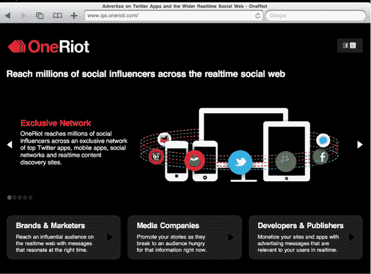

# 裁员之后，OneRiot 放弃了实时搜索门户，专注于广告网络 

> 原文：<https://web.archive.org/web/https://techcrunch.com/2010/10/12/following-layoffs-oneriot-ditches-realtime-search-portal-to-focus-on-ad-network/>

# 裁员之后，OneRiot 放弃了实时搜索门户，转而专注于广告网络

实时社交搜索网站 OneRiot 经历了动荡的几个月。8 月，公司[屈服于裁员，重组了](https://web.archive.org/web/20221231100738/https://techcrunch.com/2010/07/30/layoffs-reshuffle-at-oneriot/)的执行董事会，由负责战略、销售、分销和营销的前总裁[托拜厄斯·佩格斯](https://web.archive.org/web/20221231100738/http://www.crunchbase.com/person/tobias-peggs)担任首席执行官。首席执行官兼特斯拉董事会董事金巴尔·马斯克辞去了首席执行官的职务，成为公司董事长。在认真审视了搜索公司的业务前景后，OneRiot 将关闭其实时社交搜索门户网站，并将把精力完全放在广告网络上。

虽然 OneRiot 称实时搜索增长迅速，但它的搜索门户似乎并没有盈利。OneRiot 最近[改进了它的搜索引擎](https://web.archive.org/web/20221231100738/https://techcrunch.com/2010/05/07/oneriot/)对用户在[脸书、](https://web.archive.org/web/20221231100738/https://techcrunch.com/2010/06/18/oneriots-realtime-search-api-now-indexing-facebook-likes-and-shared-content/) Twitter、Digg 和 MySpace 上分享的赞和链接进行索引和排名。从今天起，该公司将停止这一搜索门户。

然而，Peggs 说，搜索广告确实能赚钱。OneRiot 现在将利用其开发的实时搜索技术向公众开放其广告平台(之前只对选定的合作伙伴开放)。OneRiot 表示，其广告网络目前在搜索、显示和移动资产方面每月有超过 1 亿的独立用户。

OneRiot 现在将把所有的广告形式整合到一个已建立的广告网络中。初创公司 first [在 2009 年凭借](https://web.archive.org/web/20221231100738/http://techcrunch.com/2009/09/30/oneriot-believes-it-has-a-way-to-monetize-the-realtime-web-with-riotwise/) [RiotWise、](https://web.archive.org/web/20221231100738/http://www.crunchbase.com/product/riotwise)一种将内容放在他们[实时订阅的重点位置的广告形式，冒险进入了](https://web.archive.org/web/20221231100738/http://techcrunch.com/2009/05/12/twitter-is-talking-real-time-link-search-but-oneriot-is-launching-it-today/)广告世界。

该搜索引擎还推出了热门趋势广告，这是一系列与社交网络上出现的热门话题相对应的广告。今年早些时候，OneRiot 推出了[自我更新](https://web.archive.org/web/20221231100738/https://techcrunch.com/2010/03/19/oneriot-rolls-out-realtime-ad-unit-that-refreshes-to-match-trending-topics/)实时趋势广告和一个自助版本的 RiotWise。

OneRiot 的趋势广告每月提供 4 亿次展示，正在 Twitter 应用程序(berTwitter)、桌面客户端(Digsby)、媒体共享网站(TinyPic 和 ImageShack)和
Kosmix 的 Tweetbeat 上使用。

Peggs 表示，该公司的广告形式不仅受到出版商和广告商(包括 Stella Artois、索尼电影公司和其他主要品牌)的青睐，而且互动程度也高于普通广告。One Riot 的移动广告点击率平均在 0.7%到 1%之间。这家初创公司实时搜索广告的点击率为 3.5%至 4%(是搜索广告平均点击率的两倍)。

对创业公司来说，重新聚焦商业模式从来都不是坏事。虽然 OneRiot 在这个夏天可能遇到了困难，但该公司似乎正在为一些职位招聘人员，如果 OneRiot 的广告表现像公司声称的那样，那么该平台未来可能会为移动和网络应用程序提供实时广告。当然，该公司面临着其他一些试图帮助社交应用赚钱的公司的竞争，包括 140 Proof、Ad.ly 甚至 Twitter。

