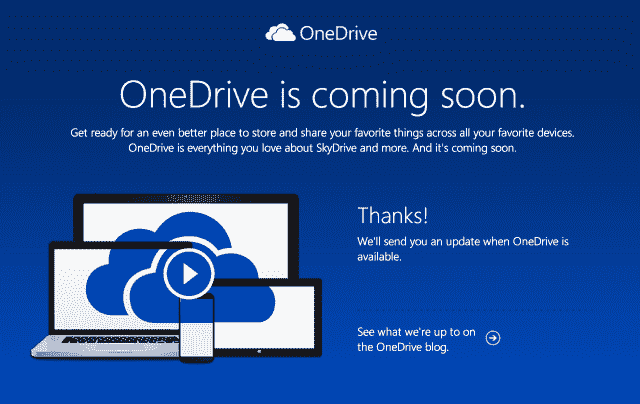

# 在与英国天空广播公司发生商标纠纷后，微软将“SkyDrive”更名为“one drive”

> 原文：<https://web.archive.org/web/http://techcrunch.com/2014/01/27/following-trademark-dispute-microsoft-rebrands-skydrive-to-onedrive/>

# 在与英国天空广播公司发生商标纠纷后，微软将“SkyDrive”更名为“OneDrive”

为了在竞争激烈的市场中更好地定位自己的产品，微软喜欢给面向消费者的产品重新命名。例如，只要看看 Outlook.com，以前的 Windows Live Mail，以前的 Hotmail。但今天，微软将其云存储服务“SkyDrive”更名为“OneDrive”不仅仅是试图通过重命名一项旧服务来吸引消费者的注意力。相反，这是微软将“SkyDrive”商标让给另一方的例子。

正如微软在他的[博客文章](https://web.archive.org/web/20230328115642/http://blog.onedrive.com/onedrive-for-everything-your-life/)中所指出的，更名背后的真正原因是与欧洲广播公司 BSkyB 的纠纷，后者声称“SkyDrive”这个名称侵犯了它自己的商标。该公司是欧洲最大的付费电视提供商之一，提供在线流媒体、移动应用程序，甚至在 2008 年至 2011 年期间拥有自己的在线存储服务“Sky Store & Share”。

英国天空广播公司将微软告上法庭，迫使其改变其云存储服务的名称，该服务于 2007 年首次推出。(以前称为 Windows Live SkyDrive 和 Windows Live Folders–明白我说的微软品牌重塑是什么意思了吧？)

TechCrunch [披露了 BSkyB 在法庭上获胜的消息](https://web.archive.org/web/20230328115642/https://techcrunch.com/2013/06/28/uks-bskyb-wins-judgement-against-microsoft-over-use-of-skydrive-name-in-europe/)——该案件始于 2011 年 6 月，具体涉及“假冒和侵犯‘SKY’标志的两个注册社区商标(CTM)和两个英国注册商标(UKTMs)的诉讼，原告[BSkyB]试图阻止被告[微软]在整个欧盟使用‘SKY drive’作为其云存储服务的名称。”

与此同时，微软声称不容易将其基于云的 SkyDrive 服务与 BSkyB 的付费电视、移动和在线服务混淆。

2013 年 6 月，在英国天空广播公司赢得英格兰和威尔士高等法院的判决后不久，双方宣布在当年 7 月达成和解。微软决定不上诉正如它之前威胁的那样，而是同意将其服务转移到一个新品牌。

虽然微软本可以在受影响的欧洲市场将名称改为“one drive ”, BSkyB 可以在那里提出自己的主张，但该公司正确地决定将整个品牌转移到新的东西上。

为什么是“OneDrive？”微软在其官方 ~~SkyDrive~~ OneDrive 博客上解释道，“我们知道在你的生活中会有越来越多的设备，但你真的希望只有一个地方存放你最重要的东西。一个地方存放您所有的照片和视频。一个地方存放您所有的文档。一个无缝连接您使用的所有设备的地方。您希望生活中的一切都由 OneDrive 来完成。”

微软在博客中指出，SkyDrive 服务本身没有变化，随着新名称在微软的产品组合中推广，所有用户的内容仍将保留在 OneDrive 和 OneDrive for Business 上。然而，OneDrive [预览页面](https://web.archive.org/web/20230328115642/https://preview.onedrive.com/)暗示可能会有新的东西，称“OneDrive 是你喜欢的 SkyDrive 的一切，甚至更多。”该页面目前接受那些希望在 OneDrive 上线时收到通知的人的电子邮件注册。

【YouTube http://www.youtube.com/watch?v=e4NsPPUDjyU？feature = player _ embedded & w = 640 & h = 360]