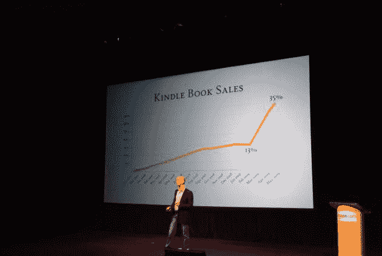

# 对于 Kindle 上的书籍，现在的销售额占印刷销售额的 35% 

> 原文：<https://web.archive.org/web/https://techcrunch.com/2009/05/06/for-books-available-on-kindle-sales-are-now-tracking-at-35-percent-of-print-sales/>

杰夫·贝索斯今天在亚马逊的 Kindle DX 发布会上说的最令人吃惊的事情是这个统计数据:对于 Kindle 上可用的书籍，销量已经是印刷书籍的 35%，而几个月前只有 13%。换句话说，如果一本纸质书在亚马逊上卖出 1 万本，它将在 Kindle 上多卖出 3500 本数字书。让我再重复一遍，Kindle 上的数字图书在上市 18 个月后，销量只有实体书的 35%。

这是一个惊人的增长。Kindle 现在有 275，000 本书，其中大部分是“标题”书，很可能占亚马逊图书总销量的大部分。那么现在亚马逊的图书销售中有多少是数字化的呢？我试图在新闻发布会上问一些亚马逊的高管，但他们不肯说。这无疑是一个巨大的数字。亚马逊每季度销售价值 27 亿美元的“媒体”，包括书籍、音乐和电影。如果不是最大的类别，书籍仍然是最大的类别之一。假设亚马逊每个季度销售价值 10 亿美元的书籍。它的 275，000 本书代表了 80%的销售额。仅 Kindle 图书的销售额就将达到 2.8 亿美元(每年 11 亿美元)，这还不包括设备的成本。**见下面的更正。**

这些数字是我瞎编的，但即使你把它改成 50%，Kindle 图书的销售趋势将是每季度 1.75 亿美元(每年 7 亿美元)。Kindle 可能会成为亚马逊迄今为止增长最快的业务。

**更正**:在我贴出这个之后，我试图再次核实这些数字。35%指的是售出的图书数量或单位数量，而不是收入，实际上是附加的。那么让我们再举一次上面的例子。如果一本书以实体形式售出 10，000 册，再以数字形式售出 3，500 册，则总共售出 13，500 册。Kindle 部分的销售额只有实体图书的 35 %,但却占了总销售额的 26%。(把它显示为印刷书籍的百分比，而不是总销售额的百分比，会让幻灯片看起来更好)。

所以让我们用这个新的数字，26 %,来应用我上面的假设。占销售额的 80%，而不是一个季度 2.8 亿美元，它将是 2.08 亿美元(8 亿美元的 26%)。50%的话，将会是 1.3 亿美元(5 亿美元的 26%)。

但是还有一步。你还得考虑到 Kindle 的书比纸质书便宜，至少对于新书来说是这样。Kindle 上的新书售价为 9.99 美元，而精装书的售价为 24.99 美元。你还必须考虑平装本的书，最近出版的书往往要 10 美元左右。所以有一些折扣。为了便于讨论，我们假设它平均打了 50%的折扣。这将使收入数字再次减半，分别降至 1.04 亿美元和 6500 万美元。按年计算，Kindle 图书的收入在 5.2 亿至 2.6 亿美元之间(同样，这不包括设备收入)。

这些数字根据你的假设而变化，但作为比较，花旗分析师马克·马哈尼估计今年 Kindle 图书的销售额仅为 1.89 亿美元，2010 年将达到 6.12 亿美元(如果加上设备销售，2010 年 Kindle 相关的总销售额为 12 亿美元)。至少，看起来亚马逊很有可能达到马哈尼的估计，甚至可能已经超过了他们。