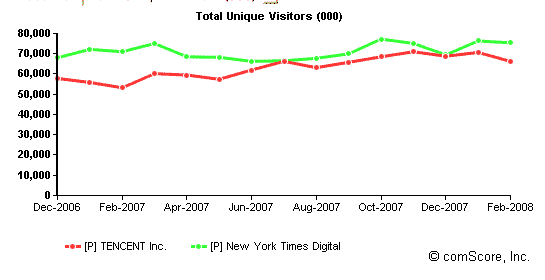

# 对于中国即时通讯门户腾讯来说，钱在微交易上

> 原文：<https://web.archive.org/web/https://techcrunch.com/2008/03/27/for-chinese-im-portal-tencent-the-money-is-in-micro-transactions/>

# 对于中国即时通讯门户腾讯来说，微交易才是赚钱之道

 在中国，钱不在网络广告上。它在微交易中。至少对腾讯来说是这样，它运营着中国最大的即时通讯网络，也是最大的门户网站之一。腾讯旗下包括 QQ IM 服务、QQ Show(一个模仿韩国 Cyworld 的虚拟形象社交网络)和 QQ Pet(虚拟宠物门户网站)，是世界上第 21 大网络资产，也是仅次于百度的中国第二大网络资产(两家公司一直在排名第一和第二)。2 个点)。根据 comScore 的数据，它在 2 月份吸引了 6620 万独立访客，比百度少 50 万，比纽约时报数字版运营的所有网站(包括 NYTimes.com、About.com、Boston.com 和其他一些报纸网站)少 1000 万。

腾讯是上市公司。2007 年，该公司收入 5.23 亿美元，营业利润 2.24 亿美元。这给了它 43%的营业利润。相比之下，雅虎的运营利润率为 10.4%。

这种盈利能力差异的一个重要原因是广告仅占其收入的 13%。其余的是数字商品、在线游戏和其他中国网民乐于支付的服务的微交易，以及移动服务。以下是腾讯的收入[细分](https://web.archive.org/web/20230326025004/http://www.plus8star.com/?cat=13):

> 互联网服务(数字商品、游戏、微交易):3.44 亿美元(66%)
> 移动服务:1.1 亿美元(21%)
> 在线广告:6700 万美元(13%)
> 
> 总收入:5.23 亿美元

数字商品是中国网络公司的一大收入来源，利润极高。在美国，除了少数例外(虚拟世界和在线视频游戏中的虚拟经济)，网络冲浪者并不真的喜欢为数字商品付费。这是文化的东西，还是可以改变的？重要的是要记住，除了广告，还有其他方式在网上赚钱。

