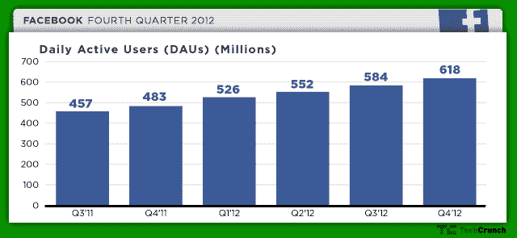
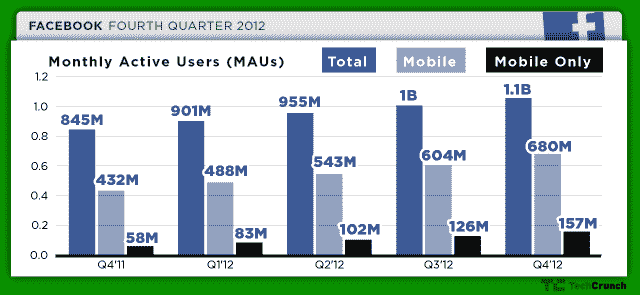

# 脸书的 6.8 亿移动用户数首次超过了桌面用户数——扎克伯格称自己现在是一家“移动公司”

> 原文：<https://web.archive.org/web/https://techcrunch.com/2013/01/30/for-the-first-time-facebook-mobile-daus-exceeded-web-daus-in-q4-2012/>

# 脸书的 6.8 亿移动用户数首次超过了桌面用户数——扎克伯格称其现在是一家“移动公司”

今天是脸书第四季度的收益日，我们了解了一些关于社交网络发展的有趣的事情。令一些人惊讶的是，移动 dau 已经超过了网络 dau，这在公司历史上还是第一次。我们知道脸书专注于利用移动设备和平台发展其网络，但看到这种使用增长如此之快令人印象深刻。

对于那些密切关注脸书的人来说，向手机的转移已经很明显了。越来越多的人在他们的移动设备上查看他们的脸书信息，完全跳过了桌面版本。这是用户行为的转变，脸书正在跟进，这很明智。

下面是第 4 季度总体 dau 的快速浏览:

【T2

总体 mau 为 1.06 亿美元，高于第三季度[的 1.01 亿美元](https://web.archive.org/web/20230327132210/https://techcrunch.com/2012/10/23/facebook-announces-monthly-active-users-were-at-1-01-billion-as-of-september-30th/)。这是本季度的数据:

这些数字都不包括 Instagram。

今天发布时，脸书创始人兼首席执行官马克·扎克伯格发表了一份声明:

> 2012 年，我们连接了超过 10 亿人，成为一家移动公司。我们带着良好的势头进入 2013 年，并将继续投资以实现我们的使命，成为一家更强大、更有价值的公司。

就赚钱而言，移动业务占广告收入的 23%，高于 2012 年第三季度广告收入的 14%。回到 9 月份的 TechCrunch Disrupt，[扎克伯格预测](https://web.archive.org/web/20230327132210/https://techcrunch.com/2012/09/11/zuckerberg-says-on-mobile-we-are-going-to-make-a-lot-more-money-than-on-desktop/)有一天，脸书会从移动用户那里获得更多收入。到目前为止还不是这样，但这种转变正在全面展开。当时，他说:

> 我们将执行这一使命，让世界相互连接，并创造长期价值。决定我们如何做的更大的问题是我们如何使用移动设备。

脸书股票[在盘后交易中下跌了 7%](https://web.archive.org/web/20230327132210/https://techcrunch.com/2013/01/30/facebooks-q4-revenue-rises-40-to-1-59b-shares-decline-7-percent-in-after-hours/),尽管其 2012 年第四季度的收入增长了 40%,达到 15.9 亿美元。自从发布以来，它又开始回升了。

在收益电话会议上，扎克伯格讨论了移动的力量:

> 它让我们接触到更多的人，这些人会有更多的参与，我们将能够从这些用户身上赚更多的钱。移动创造了一个更有活力的生态系统。

他还讨论了脸书构建移动优先应用和功能的新方法。这是每个人都在等待从脸书那里听到的消息，因为该公司一直在尝试一些新的东西，但在执行方面还没有真正兑现。

[图片来源: [Flickr](https://web.archive.org/web/20230327132210/http://www.flickr.com/photos/tikaro/4438484758/)