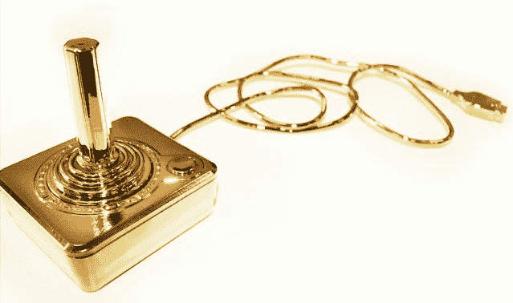

# 给拥有一切的极客:镀金雅达利 2600 

> 原文：<https://web.archive.org/web/http://techcrunch.com/2011/07/22/for-the-geek-who-has-everything-a-gold-plated-atari-2600/>

# 给拥有一切的极客:镀金雅达利 2600

大多数 30 多岁的科技界人士都有一个共同点，那就是对电子游戏的怀旧。X 一代(和第一代)可以持续几个小时讨论我们最喜欢的任天堂游戏的优点，我们在学校的编程经历，当然还有我们心爱的 Ataris。当然有 C64s 和 Amigas 等，但雅达利的 2600 和它的继任者是真正的游戏世界的开创性。

你仍然可以在这里和那里找到一些，甚至工作，但老实说，这台机器比我记忆中的要简陋一些。但是顽童协会有一个绝妙的主意，用 24k 金来永久保存这段计算机历史……[。](https://web.archive.org/web/20230203145124/http://esvc000348.wic040u.server-web.com/page2.html)

*看着它。*不美吗？现在，不管有没有用，我都不准备说。那个镀金的弹夹(不知道是什么游戏？)看起来是可移动的，我怀疑他们在 I/O 端口上镀了镀层，所以除非他们使用的系统从一开始就是砖砌的，否则它可能工作得很好。然而，控制器可能在镀金过程中失去了一点功能。

这个艺术项目的下落不明，而且不，我认为你买不到。但是很高兴知道它就在某个地方——比如埃尔多拉多，或者大脚怪。

[通过[技术顾问](https://web.archive.org/web/20230203145124/http://technabob.com/blog/2011/07/22/gold-plated-atari-2600/?utm_source=feedburner&utm_medium=feed&utm_campaign=Feed%3A+TechnabobtechNewsBlog+%28Technabob%29)