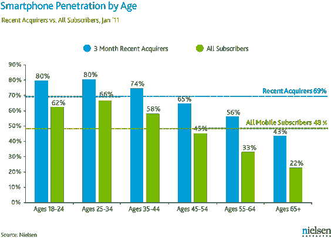

# 对年轻人来说，智能手机不再是奢侈品 TechCrunch

> 原文：<https://web.archive.org/web/https://techcrunch.com/2012/02/20/for-the-young-smartphones-no-longer-a-luxury-item/>

尼尔森今天早上发布的新数据审视了典型的美国智能手机用户，特别是他们的年龄和收入，以及智能手机对不同人口群体的渗透。像这样的数据可以帮助开发者、出版商和广告商更好地了解谁拥有智能手机，但它也可以帮助确定这些设备是否由于较低的价格点而成功打入低端收入阶层。

后一个问题的答案是肯定的:即使年收入低于 1.5 万美元的人也可能拥有智能手机——但前提是他们还年轻。超过一半(56%)的收入阶层是智能手机用户，年龄在 18-24 岁之间。在 25-34 岁年龄组中，该收入水平的人中有 43%在有限的预算中为智能手机腾出了空间。在更务实的 35-44 岁年龄段，收入低于 15，000 美元的人中有 31%拥有智能手机。

虽然这些移动用户不一定生活在贫困线以下(不清楚他们是否单身、已婚、养家等。)，他们也不远了。例如，在 [2011 年](https://web.archive.org/web/20221207180730/http://aspe.hhs.gov/poverty/11poverty.shtml)，一个收入在 10890 美元或以下的单身人士生活贫困。只要每年增加几千部，突然间，他们就拥有了智能手机。

在年龄较大的群体中，智能手机的普及率有所下降，但在较高收入群体中，这种下降在很大程度上也是如此。坦率地说，这些数字令人惊讶。它们表明，无论是设备本身的费用还是附带的数据计划，智能手机都越来越成为必需品，而不是奢侈品。你还能如何解释一个收入低于 15000 美元的人买得起一辆车？他们找到了方法。也许他们连电脑都没有？或者在 18-24 岁年龄组，父母仍然会帮忙。但是年龄在 25-34 岁之间？那些购买的决定是他们自己的，很可能是在不受父母控制的情况下做出的。

尼尔森的“按年龄划分的智能手机渗透率”图表进一步反映了这一趋势，该图表显示，在过去 3 个月内购买手机的 18-24 岁和 25-34 岁年龄段的人中，有 80%选择了智能手机。

尼尔森自己的分析并没有集中在数据的这一方面，而是专注于年轻人拥有智能手机的总体趋势。或者当年龄和收入都考虑在内时，收入较高的老年用户更有可能拥有智能手机(即，收入超过 100K 的 55-64 岁的人与收入 35-75K 的 35-44 岁的人一样有可能拥有智能手机)。

这也很重要，尤其是当它与低收入/年轻人口统计数据相关时。对于老一代人来说，智能手机*是*奢侈品。如果有钱，这些人更有可能购买。

但是对于最年轻的手机用户来说，智能手机是必须的。他们正在想办法买得起。