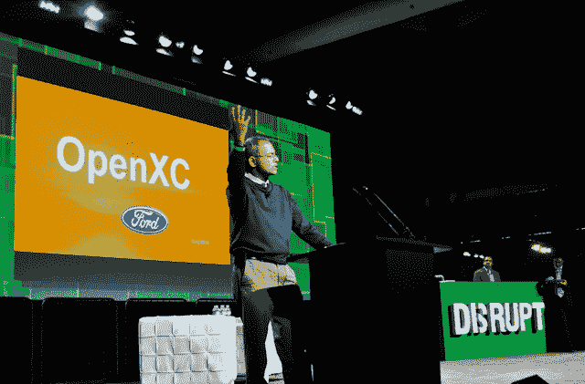

# 福特与 Bug Labs 合作开发车内创新开源平台 TechCrunch

> 原文：<https://web.archive.org/web/https://techcrunch.com/2011/09/12/ford-partners-with-bug-labs-to-develop-open-source-platform-for-in-car-innovatin/>

在周六举行的 TechCrunch 黑客马拉松上，拥有 108 年历史的全美汽车制造商福特与美国新兴的音乐服务公司 Spotify 合作，向寻求利用车载设备整合应用和移动服务的开发者展示了越来越多的机会。

今天在三藩市举行的 TechCrunch Disrupt 上，福特希望继续推进车内连接和小配件，宣布与 [Bug Labs](https://web.archive.org/web/20230204222132/http://www.buglabs.net/) 建立合作伙伴关系，这是一家开源硬件和软件提供商，修补匠和工程师可以用它来创建自己的数字设备。两家公司将合作开发一个名为 OpenXC 的新车载研究平台，该平台旨在将汽车转变为一个即插即用的平台，支持开源硬件和软件，允许开发者将汽车变成各种酷新技术的游乐场。

OpenXC 基于 Bug Labs 的 [Bug 系统](https://web.archive.org/web/20230204222132/http://www.buglabs.net/products)，将允许用户通过视频和音频反馈接口以及环境传感器和安全设备等附加设备来创建个性化的驾驶体验——只需将 Bug Labs 的硬件模块安装到车辆的控制台上。

福特研究和创新高级技术负责人 K. Venkatesh Prasad 表示，OpenXC 旨在创建一个对开发者社区完全开放的平台，允许工程师和黑客以合理的价格向消费者提供酷的车载解决方案。虽然 Bug Labs 已经与威瑞森、Sprint、美国电话电报公司、Pitney Bows 等开发商和企业合作设计和测试创新设备，但福特是第一家与 Bug Labs 合作的汽车原始设备制造商。

总的来说，汽车变得越来越智能，汽车互联创新的机会也在不断增加。福特表示，它希望将 OpenXC 研究项目作为测试新的娱乐和连接解决方案的一种方式，并在不断变化(越来越科技化)的格局中占据领先地位，如快速变化的内容偏好和“按需购买”的租赁应用解决方案。

由于亚洲将在未来十年成为汽车销售的一大来源，普拉萨德举了一个喜欢板球运动的福特车主的例子。通过 OpenXC，司机可以从当地的福特经销商那里购买 15 美元的板球模块，这是由当地开发商设计并经福特批准的，可以插入汽车的主控板，播放专门用于板球的社区电台。赛季结束后，车手可以用另一个模块来替换这个模块，无论是以运动为中心的还是其他的。

OpenXC 旨在为福特研究人员和第三方开发人员提供一个低成本的沙箱，他们可以在其中共享、测试和验证任何和所有与车内连接相关的概念。这个想法是允许其开放平台为司机社区提供定制驾驶体验的能力，同时允许福特等制造商避免为特定市场制造可定制的车辆。相反，通过 OpenXC 的沙盒，福特正在向第三方开放定制，使个性化的驾驶体验能够在多个来源的参与下继续，而不必倾家荡产。

 在 Disrupt 上，福特和 Bug Labs 使用福特嘉年华展示了 OpenXC 平台，展示了一个原型“燃油经济性挑战”应用程序，该应用程序使用 Bug Labs 的硬件和软件模块在车辆驾驶舱中提供一个 LED 燃油效率显示模块。当启动并运行时，该应用程序会照亮挡风玻璃，显示驾驶员当前的燃油效率。然后，车手可以访问实时数据，了解挑战中其他人的表现，以及谁的驾驶效率最高。

很高兴看到一家曾经陷入困境的汽车制造商找到了新的方法来保持相关性，并为其司机提供由年轻的美国初创公司和科技公司开发的令人难以置信的技术的所有好处。开发者和工程师们，一定要注意这一点。