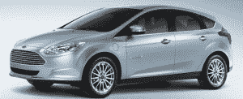

# 福特将与电动汽车一起销售太阳能电池板系统 

> 原文：<https://web.archive.org/web/http://techcrunch.com/2011/08/17/ford-to-sell-solar-panel-system-alongside-electric-cars/>

# 福特将与电动汽车一起销售太阳能电池板系统

福特汽车公司正在[与总部位于圣荷西的太阳能电池板制造商](https://web.archive.org/web/20230203143759/http://media.ford.com/article_display.cfm?article_id=35036) [SunPower](https://web.archive.org/web/20230203143759/http://www.sunpowercorp.com/) 合作，提供屋顶太阳能系统选项，该选项将与即将上市的福特福克斯 EV 一同出售。这个名为“绿色生活”的项目，包括在顾客家中安装太阳能电池板。

然而，这些面板不仅仅是用来给焦点充电的。它们实际上有助于抵消不得不给汽车充电带来的成本，这是大多数电动汽车车主每天晚上都要做的事情。

福特表示，2.5 千瓦的太阳能电池板系统将抵消每月 1000 英里的成本。在联邦税收抵免后，该系统的成本大约为 10，000 美元。一些地方和国家的回扣也可能是可用的，但它仍然是一个相当昂贵的系统。

 至少福特和 SunPower 针对的是合适的人群。这种选择应该会吸引那些想买电动汽车，但又不想为消耗所有额外的电来充电而感到内疚的环保主义者。毕竟，当你用化石燃料给汽车充电时，开电动车并不真正“环保”。

太阳系本身由 147 平方英尺的屋顶板组成。共有 11 块面板，尺寸为 4 英尺×2 英尺。客户将能够在线并通过一个特别设计的 iPhone 应用程序来监控电池板的性能。SunPower 还为该系统提供 25 年的保修，该系统由百思买的极客小队安装在客户家中。百思买还与福特签订了安装家用充电器的合同。

新款 2012 款福特福克斯的定价和确切上市日期尚未确定，但该车将于 2011 年第四季度首先在加州和纽约上市。福特还计划于 2012 年在北美推出另外 5 款电动或混合动力车型，2013 年在欧洲推出。