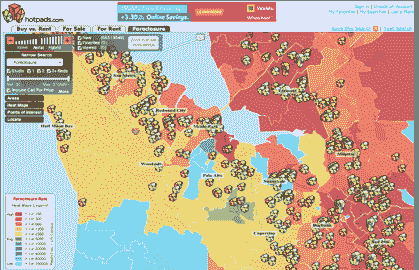
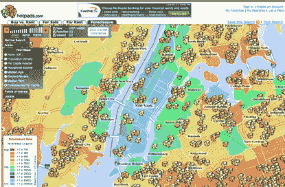

# 可怕的侵犯热图上显示的止赎权 

> 原文：<https://web.archive.org/web/http://techcrunch.com/2008/04/07/foreclosures-shown-on-scary-encroaching-heat-maps/>

# 可怕的侵犯热图上显示的取消抵押品赎回权

如果你想清楚地看到抵押贷款危机是如何在全国蔓延的，去房地产搜索网站 [HotPads](https://web.archive.org/web/20230203002938/http://hotpads.com/main.htm) 看看你所在地区的止赎热图。这些地图混搭从 [RealtyTrac](https://web.archive.org/web/20230203002938/http://www.realtytrac.com/) 获取止赎数据，并将它们覆盖在彩色编码的地图上。红色表示人均房产止赎率高，蓝色表示水平低。由于取消抵押品赎回权的比率现在达到创纪录水平，这些地图上有很多红色。例如，在硅谷，只有像帕洛阿尔托和桑尼维尔这样的少数几个小地方仍处于蓝色之中。纽约市的一张照片显示，止赎权开始从外围城区向曼哈顿逼近。

除了 HotPads 上的 50 万套止赎房屋，该网站还列出了 120 万套待售房屋和 13 万套活跃的出租房屋(联合创始人道格拉斯·波普(Douglas Pope)称，这是仅次于 Craigslist 的第二大出租房屋清单)。这些都是从房地产经纪人网站上挑选出来的，由业主直接提交。

