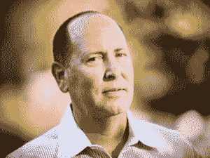

# 前微软和谷歌员工 Lucovsky 离开 VMware 投入新项目，椅子扔出没有消息 

> 原文：<https://web.archive.org/web/https://techcrunch.com/2013/09/27/former-microsoftie-and-googler-lucovsky-leaves-vmware-for-new-project-no-word-on-chairs-thrown/>

# 前微软和谷歌员工 Lucovsky 离开 VMware 开始新的项目，没有关于椅子被扔的消息

VMware 工程副总裁马克·洛考夫斯基将离开这家虚拟化巨头，开启“新篇章”，他在 Twitter 上称之为“第九章”。Lucovsky 在 VMware 工作了大约四年，在此之前，他曾在谷歌和微软任职。

VMware [告诉 GigaOm](https://web.archive.org/web/20230129094610/http://gigaom.com/2013/09/26/another-vmware-star-mark-lucovsky-heads-for-the-exit/) “在 VMware 的四年多时间里，马克·洛考夫斯基作为工程副总裁，为公司的开发工作做出了重要贡献，包括他帮助建立 VMware 的云铸造厂，该厂现在是 Pivotal 的一部分。我们感谢马克的贡献，并祝愿他一切顺利。”

在谷歌，Lucovsky 担任负责 API 战略的[工程总监](https://web.archive.org/web/20230129094610/http://www.eweek.com/c/a/Search-Engines/Google-Engineering-Director-Leaves-for-VMware-279800/)。自从他离开微软(他在那里从事 Windows NT 工作)后，许多人都把他的聘用解读为“谷歌操作系统”的先兆。Lucovsky 在微软工作了 16 年，参与了各种项目，包括从未真正实现的“[开放网络”项目 HailStorm](https://web.archive.org/web/20230129094610/http://www.microsoft.com/en-us/news/features/2001/mar01/03-19hailstorm.aspx) 。他被授予“杰出工程师”的称号。 

尽管他在微软任职期间参与了许多项目，但他职业生涯中最令人难忘的轶事无疑是当他告诉首席执行官史蒂夫·鲍尔默他将离开去谷歌的时候。早在 2004 年，微软和谷歌之间的一起企业挖人案中的一份声明描绘了一幅生动的画面:

> 在加入谷歌之前，大约在 2004 年 11 月 11 日，我安排了一次与微软首席执行官史蒂夫鲍尔默的会面，讨论我的离职计划。在谈话的某个时候，鲍尔默先生说:“告诉我这不是谷歌。”我告诉他是谷歌。
> 
> 这时，鲍尔默拿起一把椅子，扔到房间的另一头，砸到了他办公室的一张桌子上。鲍尔默先生接着说:“他妈的埃里克·施密特是个他妈的娘们。我要他妈的埋葬那个家伙，我以前做过，我还会再做一次。我要他妈的干掉谷歌。”….
> 
> 此后，鲍尔默先生继续试图说服我留下来。除此之外，鲍尔默先生告诉我“谷歌不是一家真正的公司。这是一座纸牌屋。”

Lucovsky 只是使用了这个神秘的标签来表明他接下来可能会做什么，但我们会继续关注更多。当 Lucovsky 在 VMware 工作了 5 年后递交辞呈时，很可能没有人扔椅子。

【T2