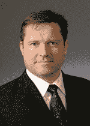

# 前 MySQL 首席执行官马丁·米科斯加入 Index Ventures，成为 EIR·

> 原文：<https://web.archive.org/web/https://techcrunch.com/2010/01/28/former-mysql-ceo-marten-mickos-joins-index-ventures-as-eir/>

# 前 MySQL 首席执行官马丁·米科斯以 EIR 的身份加入 Index Ventures

[MySQL](https://web.archive.org/web/20221007161453/http://www.crunchbase.com/company/mysql)的前首席执行官莫滕·古斯塔夫·米科斯，已经加入 [Index Ventures](https://web.archive.org/web/20221007161453/http://www.indexventures.com/) 担任常驻企业家( [EIR](https://web.archive.org/web/20221007161453/http://en.wikipedia.org/wiki/Entrepreneur_In_Residence) )。

四个月前，这名男子[加入了另一家风险投资公司](https://web.archive.org/web/20221007161453/http://www.beta.techcrunch.com/2009/09/29/former-mysql-ceo-marten-mickos-joins-benchmark-as-entrepreneur-in-residence/)，总部位于硅谷的[基准资本](https://web.archive.org/web/20221007161453/http://www.benchmark.com/)，也就是 EIR。

Index Ventures 在一份声明中表示，Mickos 将专注于在欧洲技术市场寻找新的投资机会，代表风投公司帮助识别和评估公司。

对于欧洲企业家和有前途的初创公司来说，这绝对是个好消息。

米科什从 2001 年 1 月到 2008 年 2 月担任开源数据库公司 MySQL 的首席执行官，当时 Sun Microsystems [以 10 亿美元收购了该公司](https://web.archive.org/web/20221007161453/http://www.beta.techcrunch.com/2008/01/16/sun-picks-up-mysql-for-1-billion-open-source-is-a-legitimate-business-model/)。

就像 Benchmark 一样，Index Ventures 是该公司相对早期的投资者；2003 年，他们一起参与了 2000 万美元的 B 轮融资。

米科斯拥有赫尔辛基理工大学的技术物理学硕士学位，同时也是 Mozilla Messaging 和 RightScale 的董事会成员。

(经由 [@IndexVentures](https://web.archive.org/web/20221007161453/http://twitter.com/IndexVentures/status/8319617469) / [新闻稿](https://web.archive.org/web/20221007161453/http://www.indexventures.com/news#news/index/news_id/238))