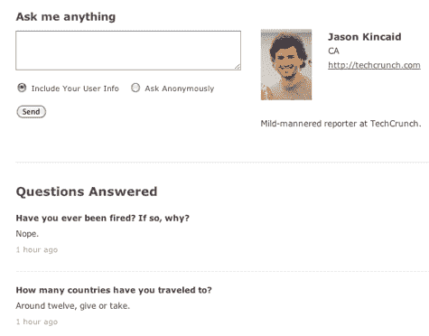

# 在 Formspring.me 上，任何人都可以问你任何问题。你会喜欢的。TechCrunch

> 原文：<https://web.archive.org/web/https://techcrunch.com/2010/01/04/formspring-ask-me-anything/>

# 在 Formspring.me 上，任何人都可以问你任何问题。你会喜欢的。

无论别人怎么说，像推特和脸书这样的社交网站最吸引人的一点是，人们确实关心你在做什么或分享什么。当有人在脸书上“喜欢”你的相册时，你会感觉很好。 [Formspring.me](https://web.archive.org/web/20221228073537/http://www.formspring.me/) 是一项新服务，将这种感觉带到了一个新的高度。它让你邀请网上的任何人向你提问，并给你一个回答问题的平台。是你自己的个人面试。看起来该网站正在迅速崛起:在 Twitter 上快速搜索“formspring.me ”,仅在最后一分钟就能得到几十个结果。

该网站的核心功能非常简单。你邀请人们问你任何他们想问的问题(他们可以选择匿名提问或者留下他们的用户信息)。然后，下次登录该网站时，您会在收件箱中看到一个未决问题列表。你可以选择你想回答的问题，删除不想回答的问题。你的答案可以是一个单词长，或者如果你愿意，你可以写几段。

结果是一连串的问题和答案，让你的朋友和粉丝了解你——把它想象成一个正在进行的采访，你既可以充当采访的主题，也可以充当主持人。该网站可以很容易地将你的 Formspring.me 帐户连接到脸书、Twitter、Tumblr 和 Blogger，允许你在写下答案时立即发布。
该网站提供了一些小工具，您可以使用它们轻松地将问题提交表单嵌入到您的博客或网站中(您可以使用下面的小工具向我提问)。你也可以使用 Twitter 和脸书邀请你的朋友问你更多的问题。如果你在社交媒体上没有特别多的追随者，这个网站可以提供一些随机的问题让你回答。

[http://www.formspring.me/jasonkincaid](https://web.archive.org/web/20221228073537/http://www.formspring.me/jasonkincaid)

当然，考虑到你可以选择你想回答的问题，你可以把这个正在进行的面试设计成完全自我服务的。鉴于许多问题很可能是匿名提交的，你甚至可以问自己一些你真正想回答的问题(“为什么是的，我*定期向慈善机构捐款并促进世界和平”)。也就是说，很容易发现这样做的人，最有趣(也最受欢迎)的用户可能是那些最愿意离开舒适区的人。*

受欢迎的用户可能会引来大量垃圾邮件和负面问题。您可以对此进行一些控制——您可以要求人们在提交问题之前登录(尽管如果他们愿意，他们的问题仍然是匿名的)。但是大多数拥有大量追随者的人可能会遇到一些令人讨厌或毫无意义的问题。当然，人们可以在 Twitter 上随意回复你，所以这不是一个新问题，你没有义务回答这些问题。

之前博客和脸书都有类似的应用，但 Formspring.me 在原创性上的不足在执行上得到了弥补。这个网站干净、易于浏览，并且很容易连接多个社交网络和博客。它目前抛出了一些数据库错误，但我怀疑这可能是因为该网站正在迅速获得动力。不难看出为什么人们称这个网站极其令人上瘾。

Formspring.me 是由提供构建 web 表单工具的公司 [Formspring](https://web.archive.org/web/20221228073537/http://www.formspring.com/) 创建的。