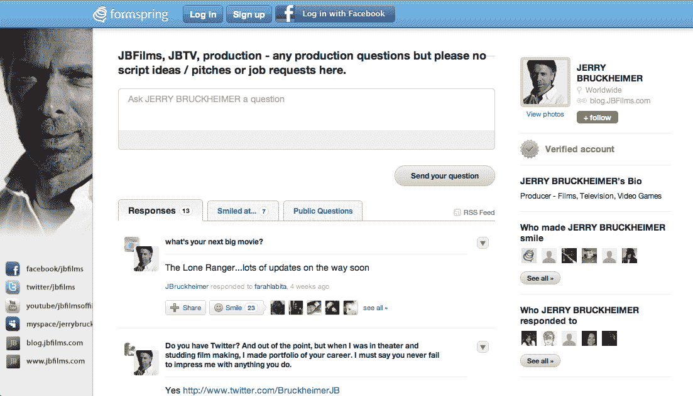

# Formspring 推出“收藏夹”目录，开始看起来像一个真正的社交网络 TechCrunch

> 原文：<https://web.archive.org/web/http://techcrunch.com/2011/11/14/formspring-launching-a-favorites-directory-starts-looking-like-a-real-social-network/>

# Formspring 推出了一个“收藏夹”目录，开始看起来像一个真正的社交网络

今天晚些时候，Formspring 将发布其首个用户目录，以更好地突出其在线社交 Q & A 服务的更受欢迎和著名的用户。该目录将用户分类，如音乐、喜剧、体育健身、时尚美容、电影、电视、科技初创公司等等。

目前的 Formspring 用户将能够通过 Formspring 上的“查找更多朋友”部分找到新功能，但你现在可以看到一些名人用户的页面，假设你知道他们的 Formspring 用户名。比如，演员[泰勒·洛特纳](https://web.archive.org/web/20230203080604/http://www.formspring.me/taylorlautner)，制作人[杰瑞·布鲁克海默](https://web.archive.org/web/20230203080604/http://www.formspring.me/JBruckheimer)，乐队[梦魔](https://web.archive.org/web/20230203080604/http://www.formspring.me/Incubus)，[我们这些国王](https://web.archive.org/web/20230203080604/http://www.formspring.me/wethekings)，还有 [SOH！3](https://web.archive.org/web/20230203080604/http://www.formspring.me/3OH3) 、漫威创意总监[汤姆·布莱福特](https://web.archive.org/web/20230203080604/http://www.formspring.me/TomBrevoort)和流行歌星[卡姆林](https://web.archive.org/web/20230203080604/http://www.formspring.me/AskCamryn)。

在发布时，该目录将拥有 100 多个受欢迎的用户，未来几周还会有更多的用户加入。它也可以通过网址[formspring.me/favorites](https://web.archive.org/web/20230203080604/http://www.formspring.me/favorites)直接访问。

这项新功能旨在补充之前推出的“Formspring 兴趣”计划，该计划允许用户在个人资料中添加最多六个兴趣，如音乐、体育、时尚和美容等。这些“兴趣”现在被新的 Formspring 收藏夹目录中的类别所反映。

更重要的是，Formspring 不仅仅是推出了一个目录，它在成为一个成熟的社交网络的道路上又迈进了一步。你可以看到该公司正在仔细周到地建立用户之间的联系，不仅是这些新的兴趣和类别之间的联系，还可以通过个人资料页面的“谁让你笑了”和“你回复了谁”来了解

Formspring 的潜在颠覆性在于，它并没有试图建立另一个脸书(*咳*，Google+，*咳*)，而是试图围绕用户的兴趣建立一个网络。当然，要做到这一点，它还是要违背脸书自己的兴趣图，基于数百万个“赞”的累积。然而，它有一个小小的优势:当一个脸书品牌页面将其信息插入到你的社交新闻提要中时，它会让人觉得打扰和讨厌。然而，当你冒险进入一个旨在让你接触品牌、名人和媒体人士的目的地网站时，你既期待又渴望同样的互动，而这种互动在脸书可能会让人感到“恶心”或烦恼。这对 Formspring 来说可能是一个潜在的胜利。

Formspring 现在有 2700 万用户，每月有超过 3000 万的独立访客。有了这种直接访问名人账户的新方式，在不久的将来流量会大幅增加也就不足为奇了。