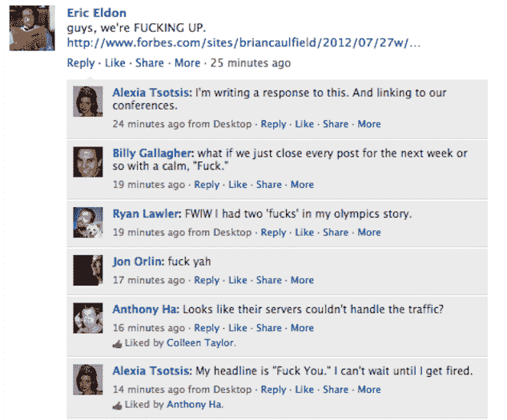

# 哟福布斯，去你的 

> 原文：<https://web.archive.org/web/https://techcrunch.com/2012/07/27/fornicating-under-consent-of-the-king/>

TechCrunch 目前缺少，[据《福布斯》杂志](https://web.archive.org/web/20221006225643/http://www.forbes.com/sites/briancaulfield/2012/07/27/aol-unit-techcrunch-q2-adjusted-f-bomb-production-down-45/)[报道](https://web.archive.org/web/20221006225643/http://www.forbes.com/sites/briancaulfield/2012/07/27/aol-unit-techcrunch-q2-adjusted-f-bomb-production-down-45/)布莱恩·考尔菲尔德。我们期望在 [< %=deadline% >](https://web.archive.org/web/20221006225643/https://beta.techcrunch.com/2012/07/26/olympics-may-be-the-reason-ha-for-todays-twitters-outage/) 的帖子中加入更多的< %=Fucks% >。

[回应](https://web.archive.org/web/20221006225643/https://www.facebook.com/EricEldon/posts/268995539873828?comment_id=1090247&offset=0&total_comments=1)我们比我更认真的联合编辑 [Eric Eldon](https://web.archive.org/web/20221006225643/http://www.crunchbase.com/person/eric-eldon) “我们令人失望的 F-Bomb 2012 年第二季度财务业绩和 2012 年第三季度前景表明，我们的 F-Bomb 业务仍处于转型之中。在我们的 F-Bomb 业务部门内，我们已经建立了 F-Bomb+的早期发展势头，我们正在增加对 F-Bomb+的投资，以取得市场成功。”

我不知道那他妈的是什么意思，因为里面有数字。即使我明白那是什么意思，我也不会在乎。

还有， [TechCrunch 扰乱 SF](https://web.archive.org/web/20221006225643/https://beta.techcrunch.com/events/disrupt-sf-2012/event-info/) 。还有，TechCrunch[CrunchUp/August Capital Party。](https://web.archive.org/web/20221006225643/http://tccrunchup2012.eventbrite.com/)

TechCrunch，他妈的是啊。