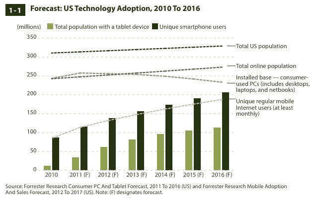
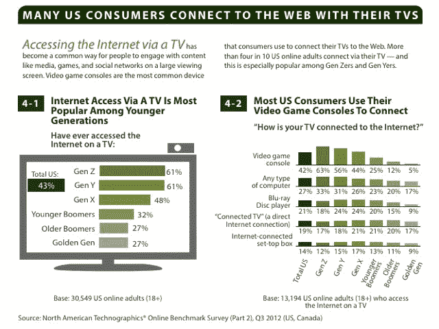

# Forrester: 84%的美国成年人现在每天使用网络，50%的人拥有智能手机，平板电脑的拥有率在 2012 年翻了一番，达到 19% 

> 原文：<https://web.archive.org/web/https://techcrunch.com/2012/12/19/forrester-84-of-u-s-adults-now-use-the-web-daily-50-own-smartphones-tablet-ownership-doubled-to-19-in-2012/>

# Forrester: 84%的美国成年人现在每天都使用网络，50%的人拥有智能手机，平板电脑的拥有率在 2012 年翻了一番，达到 19%

Forrester Research 刚刚发布了年度“[消费者和技术状况](https://web.archive.org/web/20221006084457/http://www.forrester.com//search?N=10001&range=504001&sort=3&searchRefinement=reports#/The+State+Of+Consumers+And+Technology+Benchmark+2012+US/quickscan/-/E-RES87201)”报告。像往常一样，它充满了关于美国消费者如何使用互联网的有趣统计数据，但最有趣的统计数据可能是美国的整体在线渗透率稳定在 79%(与 Forrester 在 2011 年发现的数字相同)。这是美国成年人每月至少上网一次的比例。然而，发生变化的是有多少成年人至少每天上网:2011 年，78%的美国成年人上网，2012 年，Forrester 报告称，现在有 84%的成年人每天至少上网一次。

其中一个原因当然是智能手机和平板电脑的渗透。Forrester 发现，大约一半的美国成年网民现在拥有一部智能手机，三分之二的人甚至拥有多部联网设备。自 2011 年以来，平板电脑的使用率翻了一番，目前为 19%。

Forrester 报告还指出了一个趋势，即 43%的消费者现在通过他们的电视连接到网络，该报告包括了来自美国和加拿大近 60，000 名消费者的调查数据。与类似的调查一样，Forrester 发现，这些用户中的大多数依靠他们的游戏控制台来实现这一点(42%)，而联网电视(19%)和联网机顶盒(如 Roku 或 Apple TV)仅被 14%的人使用。

毫不奇怪，Forrester 的研究还发现，不同代人之间仍有不同的使用模式。例如，18 至 23 岁的人群在社交网络上比其他任何人都活跃。Forrester 说，这些 Gen Zers 中大约 70%的人“每天访问社交网站”, 85%的人每月至少访问脸书一次。Y 一代(24-32 岁)更有可能拥有平板电脑(约 25%)和智能手机(72%)，x 一代(33-46 岁)最有可能通过网上购物来花钱(过去三个月平均 561 美元，而美国所有购物者的平均 449 美元)。

一旦你到了婴儿潮一代(47-67 岁)和所谓的“黄金一代”(68 岁以上)，技术采用显然会滞后很多。例如，年龄较大的网络成年人更可能在家里使用台式电脑，而不太可能拥有平板电脑和智能手机。尽管如此，即使在这个群体中，平板电脑的采用率自 2011 年以来也翻了一番，达到 14%。