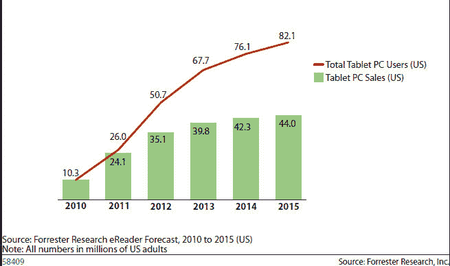

# Forrester 预测，到 2015 年，三分之一的美国在线消费者将拥有平板电脑 

> 原文：<https://web.archive.org/web/http://techcrunch.com/2011/01/04/forrester-forecasts-one-third-of-u-s-online-consumers-will-own-a-tablet-by-2015/>

# Forrester 预测，到 2015 年，三分之一的美国在线消费者将拥有平板电脑

去年，苹果用 iPad 创造了一个新的计算类别。现在，所有其他个人电脑制造商都在争先恐后地改造或推出自己的平板电脑。预计新平板电脑将在本周的 T2 消费电子展上占据主导地位。

弗雷斯特研究公司今天早上发布了一份关于平板电脑增长的新预测。该公司预计，2011 年在美国销售的平板电脑数量将从去年的 1030 万台增至 2410 万台，到 2015 年的年销量将增至 4400 万台。

到那时，预计到 2015 年，美国将有 8200 万人拥有某种类型的平板电脑，占上网人口的三分之一。至少到 2012 年，苹果仍将占据市场的“最大份额”。

我确信这一预测将在六个月内发生变化(只要看看 Forrester 六个月前过于保守的[平板电脑预测](https://web.archive.org/web/20230202225636/http://blogs.forrester.com/sarah_rotman_epps/10-07-22-apple_ipad_sales_why_tablets_are_even_bigger_we_thought))，但我确实同意触摸计算将伴随我们。