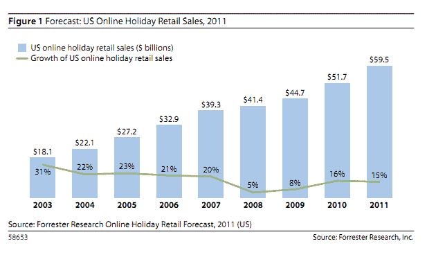

# Forrester:美国在线假日消费将增长 15%，达到近 600 亿美元 TechCrunch

> 原文：<https://web.archive.org/web/http://techcrunch.com/2011/11/11/forrester-u-s-online-holiday-spending-will-grow-15-percent-to-nearly-60-billion/>

# Forrester:美国在线假日消费将增长 15%，达到近 600 亿美元

在 2011 年第三季度电子商务销售额增长 13%之后，Forrester 估计美国在线假日销售额今年将增长 15 %,达到近 600 亿美元。该研究报告称，这种增长将会发生，因为消费者使用平板电脑购物的增加，以及在线假日交易的增长。

当然，考虑到经济和市场波动，假日零售支出会有显著增长是令人惊讶的。但 Forrester 表示，零售商正在利用“了解价格”的购物者，为在线购物和免费送货提供更有利可图的交易，尤其是在黑色星期五和网络星期一这样的大购物日。

报告显示，58%的美国人表示，他们比一年前更加注重价格，近一半的人认为他们在网上找到了更好的价格。拥有平板电脑的美国人中有 50%使用该设备搜索购买产品，30%的智能手机用户至少每月使用他们的移动设备搜索购买产品(仅在去年就增加了 30%)。越来越多的在线零售商将在移动和平板设备上提供更好的购物体验，以利用这些趋势。

Forrester 还表示，总销售额增长的 12%将来自每位买家支出的增加，而不是更多买家进入市场。一月份，comScore 报告称，2010 年在线假日消费[达到创纪录的 330 亿美元](https://web.archive.org/web/20230203075726/https://techcrunch.com/2011/01/05/online-holiday-spending-up-12-percent-to-a-record-32-6-billion/)，比 2009 年增长了 12%。Forrester 估计去年的支出略高于 500 亿美元。

随着感恩节、黑色星期五和网络星期一的到来，我们将很快看到购物者是否像预测的那样，涌向在线和移动平台进行交易和储蓄。虽然当前的技术趋势和交易的激增可能会推动电子消费，[甚至天气也可能是推动假日销售创纪录水平的一个因素](https://web.archive.org/web/20230203075726/https://techcrunch.com/2010/12/29/thanks-in-part-to-the-northeast-blizzard-online-holiday-spending-surges-to-record-30-8-billion/)。

