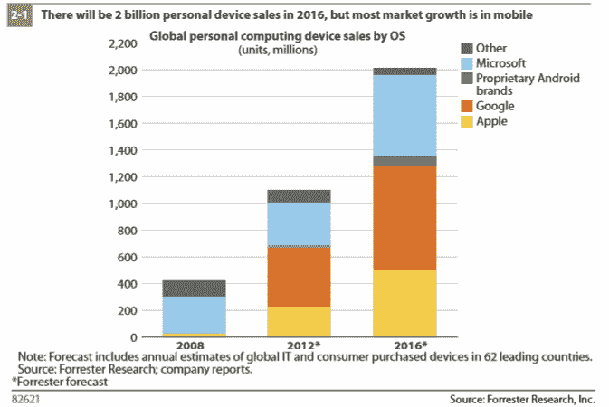

# Forrester: Windows 8 将“停止萎缩”——直到 2014 年才会站稳脚跟 

> 原文：<https://web.archive.org/web/https://techcrunch.com/2012/10/22/forrester-windows-8-will-just-stop-the-shrinking-wont-take-hold-until-2014/>

# Forrester: Windows 8 将会“停止萎缩”——直到 2014 年才会站稳脚跟

Forrester Research 分析师 Frank Gillett [预测](https://web.archive.org/web/20221206193637/http://blogs.forrester.com/frank_gillett/12-10-22-the_mobile_tsunami_reframes_windows_as_one_of_three_os_players)微软的 Windows 8 将在 2013 年缓慢起步，但将在 2014 年站稳脚跟。吉列认为，Windows 8 将使微软在个人电脑上保持相关性，但它仍将是“平板电脑的简单竞争者，智能手机的第三名。”他说，Windows 8 将“简单地阻止萎缩”，但不会是一个补丁。

报告指出，尽管微软在个人电脑上的立足点相对稳定，但该公司对智能手机和平板电脑的快速崛起反应太慢了。Forrester 分析师预测，随着个人设备销量在未来几年继续增长，该公司将无法弥补其在智能手机和平板电脑市场上与苹果和谷歌的竞争中所失去的大部分份额。总的来说，微软在个人设备操作系统市场的份额现在下降到了 30%。

Forrester 预测，微软将在 2016 年继续占据大约 90%的个人电脑市场，以及相当可观的 27%的平板电脑市场。然而，至于智能手机，吉列认为 Windows Phone 只会占据大约 14%的市场份额(吉列指出，他的一些同事甚至不确定微软是否会达到 14%)。

吉列在报告中特别提到[的一点是，微软需要一些时间来完成 Windows 8 的过渡，它将在大量架构上可用，这将使消费者感到困惑。吉列认为，Windows 8 的用户体验在不同的硬件上会有些不一致，普通消费者可能会被所有这些(和新的开始屏幕)弄糊涂。此外，他预测，Windows 商店也需要大约一年的时间才能完全储备一系列有竞争力的应用程序。](https://web.archive.org/web/20221206193637/http://www.forrester.com/Windows+The+Next+Five+Years/fulltext/-/E-RES82621)

值得注意的是，与我们最近看到的类似报告相比，Forrester 的这一预测实际上对平板电脑上的 Windows 8 更加乐观。例如，NDP 显示搜索公司[预测](https://web.archive.org/web/20221206193637/http://news.cnet.com/8301-1001_3-57426717-92/for-windows-8-tablets-a-weak-forecast/)Windows RT 平板电脑将只获得平板电脑市场的 7%左右(尽管 Forrester 报告没有区分 Windows RT 平板电脑和运行 Windows 8 Pro 的平板电脑)。