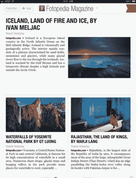
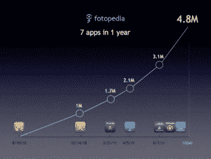
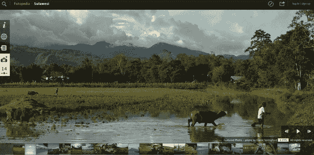

# Fotopedia 创建了一个 Flipboard 照片杂志，但它的新 HTML5 网站看起来更好 

> 原文：<https://web.archive.org/web/http://techcrunch.com/2011/09/20/fotopedia-flipboard-magazine-html5/>

# Fotopedia 创建了一个 Flipboard 照片杂志，但它的新 HTML5 网站看起来更好

在过去的一年里， [Fotopedia](https://web.archive.org/web/20230205020154/http://www.fotopedia.com/) 一直专注于[为 iPad 重新设计相册](https://web.archive.org/web/20230205020154/https://techcrunch.com/2010/08/09/fotopedia-ipad-photo-book-video/)。现在，有了 7 个应用程序和 480 万次下载，它正把注意力转向网站，创造更多类似杂志的体验。今天，它在 Flipboard 上推出了 Fotopedia 杂志，并推出了对其网站的彻底改革，该网站基于 HTML5，专为平板电脑和智能手机浏览器设计。

首席执行官 Jean-Marie Huillot 告诉我，“我们决定进入一个不同的粒度级别，一些总是新鲜的，总是新的东西，以吸引人们回来进行更多的参与。”Flipboard 中的 Fotopedia 杂志每天将突出显示五篇摄影论文，其中包括为 Fotopedia 做出贡献的高端摄影师。这些故事主要是通过图片讲述的，你可以滑动浏览，并配有一段文字和说明。照片订阅在 Flipboard 上很受欢迎，在这种情况下，Flipboard 正在从新的 [@FotopediaMag](https://web.archive.org/web/20230205020154/https://twitter.com/#!/fotopediamag) Twitter 订阅创建新的频道。

当你深入到一篇文章时，它会直接带你到 HTML5 网站(在 Flipboard 包装器内)，这是为触摸屏设计的。但即使在桌面浏览器中，它看起来也很棒，能让你快速进入全屏幻灯片。这里有一个关于冰岛的照片文章的例子，另一个是探索印度拉贾斯坦邦的照片文章的例子。

事实上，比起通过 Flipboard，我更喜欢在我的 iPad 浏览器上访问 Fotopedia 网站。尝试两者，你会看到一个 HTML5 网站如何优于应用程序的例子。导航更干净，包装器也不会碍事。但 Flipboard 仍然是一个重要的发行合作伙伴，并将把 Fotopedia 介绍给全新的观众。

Fotopedia 的宏伟目标是成为世界图片百科全书。它的观众遍布全球，近 40%在亚洲，30%在欧洲，28%在美国。仅中国就代表了 30%的观众。它吸引了 30，000 名摄影师和策展人，并通过其 iPad 应用程序为他们提供了一种获得更多曝光率甚至一点钱的方式。

iPad 相册很受欢迎，有 480 万次下载，并且还在增长。但是一旦你翻了其中的一本书，就像它翻了《国家地理》一样，就没有太多理由每天拿起它。平均而言，活跃用户每月回来两次。平板杂志的形式会让人们每天都回来。

