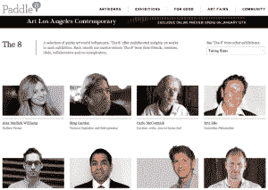
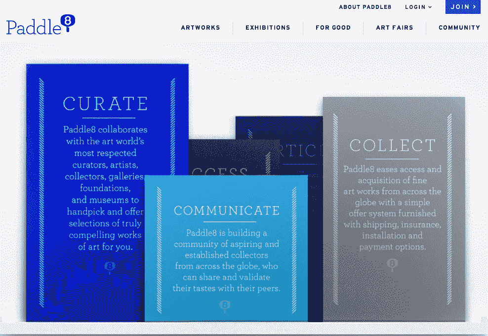

# 方正集团在 Paddle8 的在线艺术市场 TechCrunch 上投资 400 万美元

> 原文：<https://web.archive.org/web/https://techcrunch.com/2012/02/08/founder-collective-makes-a-4-million-bet-on-paddle8s-online-marketplace-for-fine-art/>

当谈到艺术品市场时，这个似乎从本质上抵制数字服务的空间，技术真的没有像在许多其他领域那样具有破坏性影响。像 Zazzle 和 Art.com 这样的初创公司已经采取措施，让艺术商业化和广泛普及，并引入了一些很酷的技术，但出于可以理解的原因，自动化和民主化还没有真正以任何重要的方式渗透到上层艺术世界。民主奢侈品听起来像是一种矛盾修饰法，或者说是虚假营销。

[总部位于纽约的早期风险投资基金 Founder Collective](https://web.archive.org/web/20221207194734/http://foundercollective.com/) ，在利基市场的颠覆性模式上进行了一些明智的押注，即优步(以及 Makerbot 和 Milo)，如今该基金正与一家名为 [Paddle8](https://web.archive.org/web/20221207194734/http://www.paddle8.com/) 的初创公司共同押注在线艺术市场。今天，方正集体宣布领投 Paddle8 的 A 轮融资，与慕思伙伴(一家隶属于奢侈品公司的私人投资公司，曾投资 Paperless Post 和 Warby Parker)一起投资 400 万美元。融资的结果是，方正集团的大卫·弗兰科尔将加入这家初创公司的董事会。

随着资本的注入，Paddle8 希望巩固其作为新手和资深收藏家的在线目的地的地位，通过精选和内部意见，以及为初创公司的店面带来自动化的交易平台，来获取美术作品。

这就是 Paddle8 的价值主张所在，一方面，它提供一套工具和服务，使画廊能够通过其平台运行后端，允许他们运送、保险和安装所购买的艺术品，而不受时间和地理的限制。(库存和交易管理仪表板正在筹备中。)

 另一方面，这家总部位于纽约的初创公司目前的股票日浏览量高达 10 万次，每月新增 2000 名精选艺术品收藏家。艺术品买家正成为越来越全球化(而非同质化)的受众，Paddle8 希望成为一项服务，向他们介绍精心打扮的艺术品和电子商务的混合物，让他们在线参与，同时简化购买、保险和运输。

Paddle8 已经与洛杉矶艺术博物馆(LACMA)和布鲁克林音乐学院(BAM)等博物馆以及 200 家其他画廊建立了合作关系。它将利用新注入的资本增强其技术和功能。对于收藏家来说，这意味着它将推出一个新的用户界面，专注于收藏家对收藏家的参与，动态编辑，定制导航，使艺术品买家能够浏览来自一系列时代和媒体的艺术品。

对于画廊、博物馆和艺术博览会来说，这意味着 Paddle8 将提供类似销售点交易平台的 B2B 服务，虚拟的“私人房间”来展示个人艺术作品(画廊一般不得不依靠发送。在展示艺术品时通过电子邮件发送 JPEGs 图片，因为它们通常不公布价格)，以及一套移动应用程序，旨在为日益增长的全球艺术爱好者带来轻松高效的搜索和购买。此外，画廊还可以在 Paddle8 的扩展画廊中以自己的名义提供展览之外的其他艺术品。

艺术的价值和意义往往依赖于背景，Paddle 希望通过邀请有影响力的人物作为策展人来为其社区提供这一方面。每个月，一位新的客座策展人都会围绕一个特定的主题推出一系列作品。目前的策展人包括独一无二的罗宾·威廉姆斯和沃霍尔的合作者和采访杂志的联合创始人格伦·奥布莱恩。目的是让这些内容成为一个多媒体档案，作为网站访问者的教育工具。

有点讽刺的是，Paddle8 正在寻求将民主化和水平化技术引入传统的线下奢侈品市场，尽管联合创始人 Aditya Julka 和 Alexander Gilkes 表示，他们并不试图促进艺术的身体和情感参与，而是“通过策展、服务和社区来加强对艺术世界的接触。”

当然，要继续这样做，他们必须赚钱，这意味着创业公司将从网站上发生的每笔交易中抽取“低两位数”的百分比。到目前为止，该团队已经能够在一个众所周知的棘手的利基市场中找到一些牵引力，无论是在游客还是收入方面，都没有太多的资本。现在有 400 万个理由让这种情况继续下去。在产品页面上添加一些增强现实技术，让用户可以看到增强的三维艺术展示，Paddle8 就可以扬帆远航。尽管它显然会受到 Art.sy 的一些反推[。](https://web.archive.org/web/20221207194734/http://www.crunchbase.com/company/art-sy)

更多信息，[点击这里](https://web.archive.org/web/20221207194734/http://www.paddle8.com/)查看公司主页。

