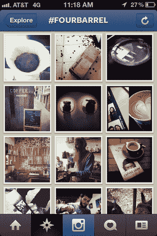

# 时尚旧金山咖啡店禁止 insta gram 

> 原文：<https://web.archive.org/web/https://techcrunch.com/2012/08/26/four-barrel-instagram/>

# 时尚旧金山咖啡店禁止 Instagram

旧金山的四桶咖啡[上周引起了轰动](https://web.archive.org/web/20221208074745/http://uptownalmanac.com/2012/08/no-more-talking-about-annoying-hipster-topics-and-who-you-fucked-last-night-four-barrel),当时它贴出了一个规则标志，包括“不要谈论令人讨厌的时髦话题”。它的波西米亚顾客一直是“自我参照”的粉丝，他们不停地用手机拍摄标志[的照片，所以 Four Barrel 不得不更新了一条新规定:“不要在 Instagram 上发布这个，你这个潮人。”](https://web.archive.org/web/20221208074745/http://uptownalmanac.com/2012/08/four-barrel-bans-instagraming-anti-hipster-signage)

这并不是 Four Barrel 对携带笔记本电脑的技术人员的唯一指责。

尽管它位于年轻的 Mission 区，距离 Twitter 和 Zynga 的办公室仅一英里，但 [Four Barrel](https://web.archive.org/web/20221208074745/http://fourbarrelcoffee.com/) 拒绝提供 wi-fi。为什么？显然，它认为一个满是阅读纸质书和与朋友聊天的人的咖啡屋比一大堆盯着 MacBook Pros 的目光更亲密。

作为教会的一员，我没意见。有很多地方可以坐下来处理电子邮件或编写代码。事实上，我认为四桶可能只是我们这个屏幕混乱的社会的一个日益严重的问题的前沿。不断地将我们的意识转移到别处，我们没有花时间停下来闻闻玫瑰，或者在这种情况下，危地马拉的咖啡。

但是，即使是咖啡馆明显回避连接和相机应用[也不能阻止计算](https://web.archive.org/web/20221208074745/http://web.stagram.com/tag/fourbarrel/)。上面的规则实际上是针对商店的室外咖啡架小巷桶，但便携式 wi-fi 热点和 4G 手机确保了在拐角处的 Four Barrel 主枢纽内有足够的网上冲浪。

尽管如此，试图创造一个没有科技含量的避难所还是值得称赞的。所以停下来喝杯啤酒，不受束缚地活在当下。

*最早被 SF 的[上城历书](https://web.archive.org/web/20221208074745/http://uptownalmanac.com/2012/08/four-barrel-bans-instagraming-anti-hipster-signage)发现。*